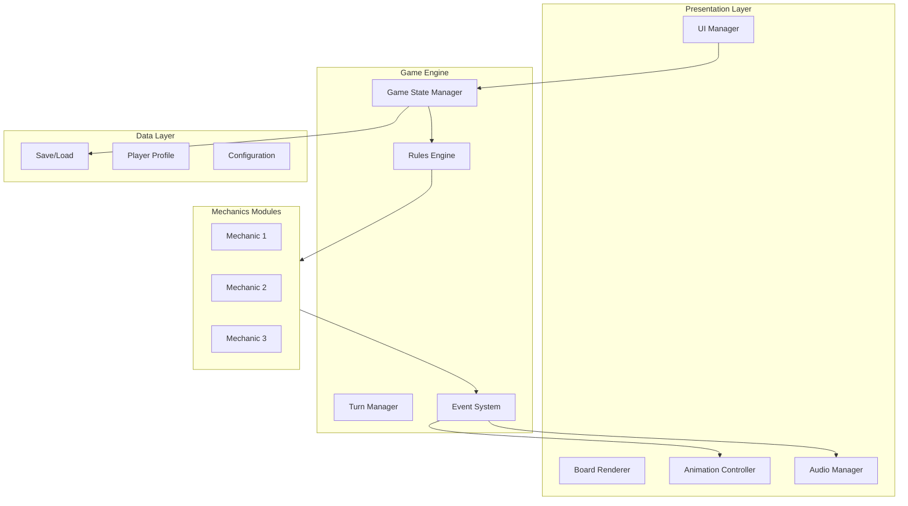

# Architecture Diagram Generator (F13)

You are a game software architect. Your task is to generate a system architecture diagram for the digital implementation of a board game.

## Input

`$ARGUMENTS` may contain:
- A reference to a feature list, GDD, or mechanics file
- An optional **target framework**: `unity`, `godot`, `phaser`, `web`, or `generic` (default: `generic`)

Example: `/architecture-diagram unity` or `/architecture-diagram output/catan/Features.csv godot`

If no files are referenced, look for a game context file (`output/*/.context.json`) to identify the active game directory, then check that directory for existing files. If multiple game directories exist, ask the user which game to use.

## Architecture Design

Based on the game's mechanics and features, design a modular system architecture covering:

### 1. Game Engine Layer
- **Game State Manager** — Holds the complete game state (board, hands, scores, turn)
- **Rules Engine** — Validates moves, enforces rules, resolves effects
- **Turn Manager** — Controls turn order, phase transitions, timing
- **Event System** — Publishes game events (card played, resource gained, score changed)

### 2. Mechanics Modules
For each identified mechanic, a dedicated module:
- Input: player action
- Processing: rule validation + state mutation
- Output: state change + events

### 3. AI Layer (if applicable)
- Decision engine
- Difficulty scaling
- Strategy patterns

### 4. Presentation Layer
- **UI Manager** — Screen management, transitions
- **Game Board Renderer** — Visual game state representation
- **Animation Controller** — Visual feedback for actions
- **Audio Manager** — Sound effects and music triggers

### 5. Data Layer
- Game state serialization (save/load)
- Player profile storage
- Configuration management
- Statistics tracking

### 6. Network Layer (if multiplayer)
- Session management
- State synchronization
- Lobby system
- Chat/communication

### 7. Platform Layer
- Input handling (touch, mouse, keyboard)
- Screen management
- Notifications
- Platform-specific integrations

## Output: Mermaid Diagram

Generate a Mermaid architecture diagram:

Customize the diagram for the specific game — use the actual mechanic names, actual component names, and actual feature names from the extraction.

## Output: Component Description

For each component in the diagram, provide:
- **Name**
- **Responsibility** (1-2 sentences)
- **Key interfaces** (what it receives, what it produces)
- **Dependencies** (what other components it needs)
- **Suggested technology** (general suggestions, not prescriptive)

## Output

Write the Mermaid diagram to `output/{game-slug}/Architecture.mmd` and the full description to `output/{game-slug}/Architecture.md`.

Display the diagram inline for the user and list the total number of components per layer.

## Framework-Specific Notes

If a target framework was specified in `$ARGUMENTS`, tailor the architecture:

### Unity
- Map to MonoBehaviour / ECS components
- Use ScriptableObjects for game data
- Event system via UnityEvents or C# events
- Suggest assembly definition structure

### Godot
- Map to Node tree hierarchy
- Use signals for event system
- Suggest scene structure and autoload singletons
- Resources for game data

### Phaser / Web
- Map to Phaser.Scene lifecycle
- Use EventEmitter for events
- Suggest state management (Redux-like or custom)
- WebSocket for multiplayer

### Generic (default)
- Framework-agnostic component architecture as currently designed
