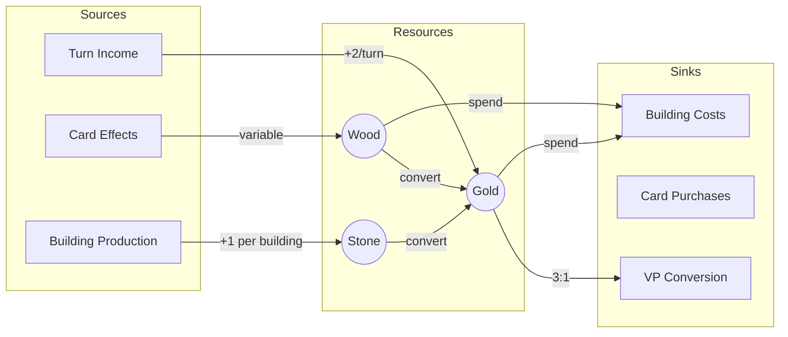

# Resource Economy Flow Diagram (F23)

You are a game economy analyst. Your task is to map the complete resource economy of a board game — every source, sink, conversion, and flow path — and produce a visual flow diagram.

## Input

`$ARGUMENTS` may reference a rules extraction, mechanics file, or balance sheet. If not provided, look for a game context file (`output/*/.context.json`) to identify the active game directory, then check for `output/{game-slug}/RulesExtraction.md`, `output/{game-slug}/Mechanics.md`, or `output/{game-slug}/BalanceSheet.md`. If multiple game directories exist, ask the user which game to use.

## Economy Analysis

### Step 1: Identify All Resources
List every resource in the game, including:
- **Explicit resources:** Named currencies, tokens, materials (gold, wood, mana, etc.)
- **Implicit resources:** Things that function as resources but aren't labeled as such (actions per turn, cards in hand, board spaces, time/turns remaining)
- **Victory resources:** Points, objectives, achievements

For each resource:
| Resource | Type | Tangible? | Shared/Personal | Capped? | Starting Amount |
|---|---|---|---|---|---|
| Gold | Currency | Yes | Personal | No | 3 |
| Actions | Tempo | No | Personal | Yes (3/turn) | 3 |
| VP | Victory | Yes | Personal | No | 0 |

### Step 2: Map Sources (Generators)
For each resource, identify how it enters the game:
- **Fixed generation:** Automatic per turn/round (e.g., "gain 2 gold per turn")
- **Action-based:** Generated by spending actions or other resources
- **Conditional:** Generated by meeting conditions (e.g., "if you control 3 farms, gain 1 wheat")
- **Random:** Generated by dice, card draws, or other random events
- **Starting pool:** Initial allocation at game start

### Step 3: Map Sinks (Drains)
For each resource, identify how it leaves the game:
- **Spending:** Used to pay for actions, purchases, or abilities
- **Decay:** Lost automatically over time (e.g., "discard down to 7 cards")
- **Conversion:** Transformed into a different resource
- **Destruction:** Removed by opponent actions or events
- **Scoring:** Converted to VP at game end

### Step 4: Map Conversions (Transformations)
Identify every resource-to-resource conversion:
| Input | Output | Ratio | Mechanism | Reversible? |
|---|---|---|---|---|
| 2 Wood + 1 Brick | 1 Road | Fixed | Build action | No |
| 3 Any Resource | 1 VP | Fixed | Trade action | No |
| 1 Action | 1-3 Gold | Variable | Worker placement | No |

### Step 5: Identify Economy Patterns

**Positive feedback loops (engines):**
Resources → buy producers → generate more resources → buy more producers
Flag these as potential snowball risks.

**Negative feedback loops (regulators):**
Leading player gets fewer resources, trailing player gets catch-up bonuses
Flag these as balance mechanisms.

**Bottlenecks:**
Points where resource flow is constrained (limited action spaces, resource caps, turn limits)
Flag these as pacing mechanisms.

**Dead ends:**
Resources that can be accumulated but have limited spending options
Flag these as potential design issues.

## Output: Mermaid Economy Flow Diagram

Generate a Mermaid diagram showing the complete resource economy:

Use:
- Rectangles for sources and sinks
- Circles/rounded for resource pools
- Edge labels for flow rates/ratios
- Color coding: green for sources, red for sinks, blue for conversions
- Subgraphs for logical grouping

## Output: Economy Health Assessment

Evaluate the economy's health:

| Metric | Assessment | Rating |
|---|---|---|
| **Resource diversity** | How many distinct resources? Too few = boring, too many = complex | 1-10 |
| **Conversion depth** | How many conversion steps from raw resource to VP? | Count |
| **Engine potential** | Can players build self-reinforcing loops? | Low/Med/High |
| **Catch-up mechanisms** | Do trailing players have resource advantages? | Yes/No/Partial |
| **Scarcity balance** | Are resources appropriately scarce? | Under/Balanced/Over |
| **Inflation risk** | Do resources become worthless over time? | Low/Med/High |
| **Decision points** | How many meaningful resource allocation choices per turn? | Count |

## Output

Write the Mermaid diagram to `output/{game-slug}/EconomyFlow.mmd`, the full analysis to `output/{game-slug}/EconomyFlow.md`.

Display to the user: total resources identified, number of conversion paths, economy health ratings, and any flagged risks (engines, dead ends, inflation).
