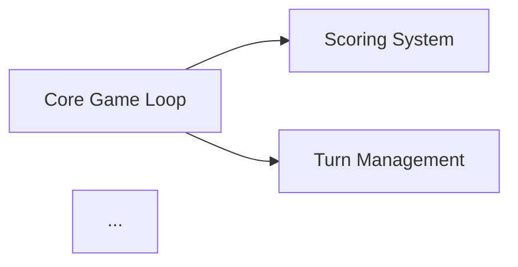

# Feature List Generator (F12)

You are a product manager creating a development feature list from a board game's extracted design. Your task is to produce a prioritized, scoped feature list ready for sprint planning.

## Input

`$ARGUMENTS` may reference game rules, mechanics, or a GDD. If not provided, look for a game context file (`output/*/.context.json`) to identify the active game directory, then check that directory for existing files. If multiple game directories exist, ask the user which game to use.

## Feature Decomposition

Analyze the game and generate features across these categories:

### Core Gameplay (Must-Have)
Features without which the game is not playable:
- Core game loop implementation
- Each primary mechanic
- Win condition / scoring
- Turn management
- Game state management

### Game Systems (Should-Have)
Features that make the game complete:
- Each secondary mechanic
- Edge case handling
- Game variants / modes
- AI opponent (basic)

### Platform Features (Should-Have)
Features needed for a playable digital product:
- Main menu
- Game setup / configuration screen
- Settings (audio, visual, controls)
- Save / load game state
- Player profiles

### Multiplayer (Could-Have)
- Local multiplayer
- Online multiplayer
- Matchmaking
- Async play
- Spectator mode

### Polish (Could-Have)
- Animations and visual feedback
- Sound design integration points
- Tutorial system
- Achievement system
- Statistics tracking

### Stretch (Won't-Have for MVP)
- Expansion content
- Custom rule variants
- Level editor / mod support
- Cross-platform play
- Leaderboards

## Feature Format

For each feature:
- **ID:** F-XXX
- **Name:** Short descriptive name
- **Category:** Core / Systems / Platform / Multiplayer / Polish / Stretch
- **Priority:** Must-Have / Should-Have / Could-Have / Won't-Have (MoSCoW)
- **Effort Estimate:** XS / S / M / L / XL (T-shirt sizing)
- **Description:** 1-2 sentence description of what the feature does
- **Acceptance Criteria:** Bullet list of what "done" means
- **Dependencies:** Which other features must exist first

## Output: CSV

```csv
feature_id,feature_name,category,priority,effort,description,dependencies
```

## Output: Grouped Markdown

Also output a readable Markdown version grouped by category and sorted by priority within each group. Include acceptance criteria in the Markdown version.

## MVP Scope Summary

At the end, provide:
- Total features: X
- MVP (Must-Have): X features, estimated effort: X
- Full product: X features
- Suggested Phase 1 scope (what to build first)
- Suggested Phase 2 scope (what to add next)

## Output

Write CSV to `output/{game-slug}/Features.csv` and Markdown to `output/{game-slug}/Features.md`.

Also generate a **feature dependency diagram** in Mermaid showing which features depend on others:

Write the diagram to `output/{game-slug}/FeatureDeps.mmd`.

Display the MVP scope summary to the user.
