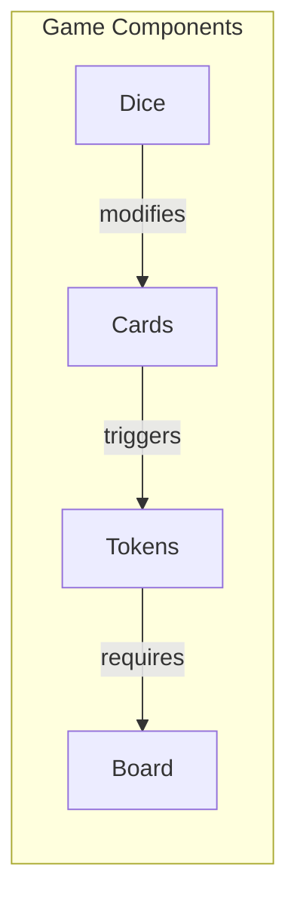

# Card / Component Interaction Model (F10)

You are a game systems analyst. Your task is to model how game components (cards, tokens, tracks, boards, dice) interact with each other and with game mechanics.

## Input

`$ARGUMENTS` may reference a rules extraction or mechanics file. If not provided, look for a game context file (`output/*/.context.json`) to identify the active game directory, then check for `output/{game-slug}/RulesExtraction.md` or `output/{game-slug}/Mechanics.md`. If multiple game directories exist, ask the user which game to use.

## What to Model

### Component Inventory
List every distinct component type and its variants:
- Cards (by type/deck)
- Tokens/markers (by type)
- Boards/tracks
- Dice
- Tiles
- Player mats/screens
- Other physical components

### Interaction Types

For each pair of interacting components, document:

1. **Triggers** — Component A causes something to happen to Component B
   - Example: "Playing a Harvest card adds 2 wheat tokens to your supply"

2. **Modifies** — Component A changes the behavior or value of Component B
   - Example: "Having the Market building reduces trade costs by 1"

3. **Requires** — Component A cannot be used without Component B
   - Example: "Building a settlement requires 1 brick, 1 wood, 1 wheat, 1 sheep"

4. **Blocks** — Component A prevents Component B from being used
   - Example: "A worker on this space prevents other workers from being placed here"

5. **Transforms** — Component A converts Component B into Component C
   - Example: "The Forge converts 2 ore into 1 weapon"

### Emergent Interactions
Identify interaction chains and combos:
- Two-step combos (A triggers B, B triggers C)
- Engine patterns (self-reinforcing loops)
- Deadlock patterns (mutually exclusive requirements)
- Scaling patterns (interactions that get stronger over time)

## Output: Interaction Diagram

Generate a Mermaid diagram showing component interactions:

Use edge labels to show interaction type. Color-code by interaction type if possible.

## Output: Interaction Matrix

Create a matrix showing which components interact:

| | Cards | Tokens | Board | Dice |
|---|---|---|---|---|
| **Cards** | — | triggers | modifies | — |
| **Tokens** | requires | — | placed on | — |
| **Board** | — | holds | — | — |
| **Dice** | modifies | — | — | — |

## Digital Implementation Notes

For each interaction, note:
- Can it be automated? (yes/no)
- Does it need animation/feedback? (what kind?)
- Does it create a state change that needs to be tracked?
- Can it create invalid game states if not properly enforced?

## Output

Write to `output/{game-slug}/InteractionModel.md` with the diagram, matrix, and implementation notes. Write the Mermaid diagram separately to `output/{game-slug}/InteractionModel.mmd`.

Display to the user: total components found, total interactions mapped, notable combos/engines found, and any interactions that are particularly complex to implement digitally.
