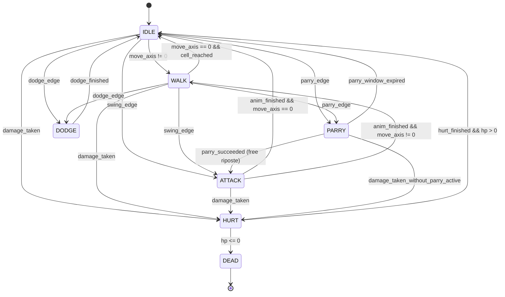
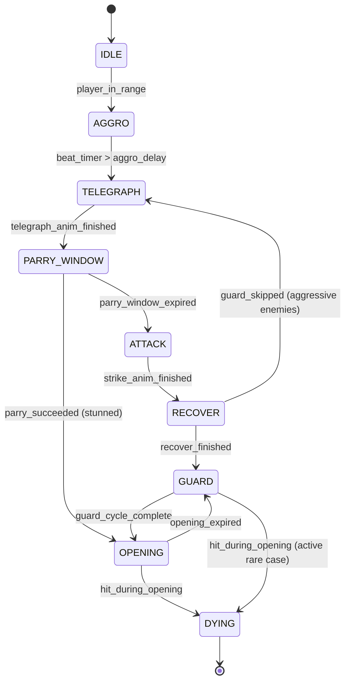
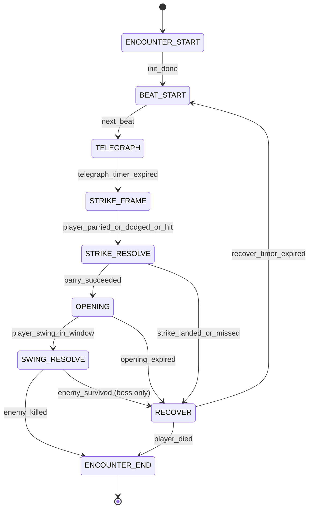
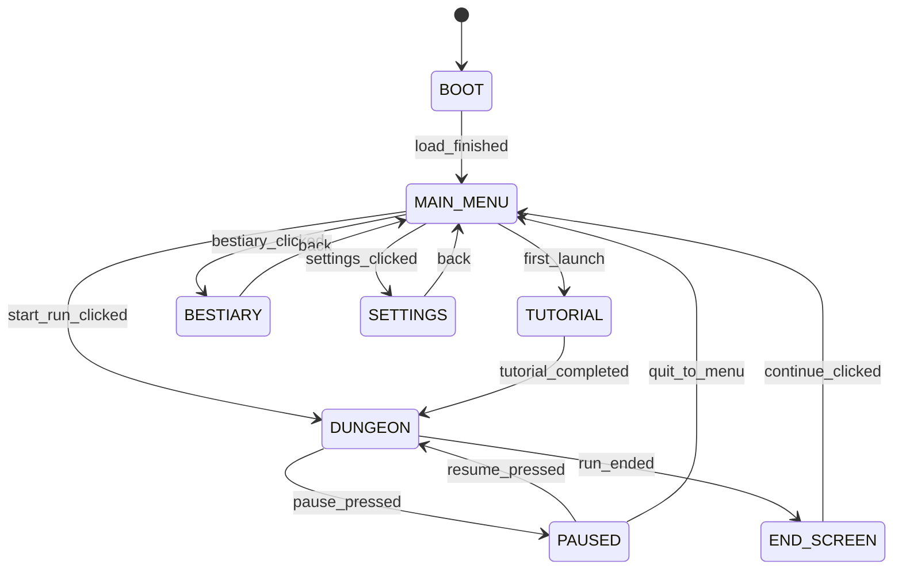

# System Architecture — Solo Dungeon Dash

> RealTimeForge Stage RT-A2: Production Technical System Architecture
> Target engine: **Godot 4.3** (GDScript primary, C# optional for hotspots)
> Sibling file: `SystemDiagram.mmd`
> Companion doc: `../revised/RT-Architecture.md` (high-level, board-to-RT justification layer)
>
> **Purpose.** This document is the engineering reference an implementer uses to start writing code on day one. Where `RT-Architecture.md` explains *why* the architecture is the way it is, this document specifies *what* to type: the literal scene tree, the literal node classes, the literal signals, the literal tick order, and the literal on-disk file format. Assume the reader has Godot 4.3 installed and a blank project open.

---

## Table of Contents

1. Runtime Architecture
2. Concrete Node/Scene Tree
3. Core Systems
4. Data Architecture
5. Tick Budget per Frame
6. State Machines (FSMs) with Diagrams
7. Determinism Strategy
8. Save Strategy
9. Networking
10. Platform Targets
11. Engine Choice & Justification
12. Build Pipeline
13. Performance Targets
14. Profiling & Debugging
15. Error Handling & Resilience
16. Test Strategy
17. Risks & Mitigations
18. Diagram Reference

---

## 1. Runtime Architecture

### 1.1 Frame-rate model

Solo Dungeon Dash is a 2D top-down action game running a **dual-loop** pattern:

- **Fixed-timestep logic loop** at 60 Hz (16.6667 ms per tick) via Godot's `_physics_process(delta)`. `delta` is guaranteed constant by Godot's internal accumulator. This is where authoritative game state advances.
- **Variable-timestep presentation loop** at the monitor refresh rate (60 / 120 / 144 / 165 Hz) via Godot's `_process(delta)`. This is where interpolation, VFX, camera smoothing, and audio scheduling happen.

Godot exposes the fixed tick rate via `Engine.physics_ticks_per_second` (default 60). We set it explicitly in `project.godot`:

```ini
[physics]
common/physics_ticks_per_second=60
common/physics_jitter_fix=0.5
```

We do **not** use `project.godot`'s `force_fps` setting; instead we honour monitor refresh and rely on Godot's interpolation (`Node2D.top_level = false` + interpolation on `Transform2D`) for smooth rendering above 60 Hz.

### 1.2 Main loop pseudocode

Godot's main loop is managed by the engine (`SceneTree`), but the per-frame execution shape is:

```
# Engine-provided, conceptual shape of the Godot 4 main loop
loop forever:
    accumulator += real_delta

    while accumulator >= FIXED_DT:              # may run 0..N times per frame
        SceneTree.physics_frame               # emits 'physics_frame' signal
        for each Node in tree (depth-first):
            node._physics_process(FIXED_DT)
        accumulator -= FIXED_DT

    SceneTree.process_frame                     # emits 'process_frame' signal
    for each Node in tree (depth-first):
        node._process(real_delta)

    RenderingServer.render_frame()
    AudioServer.mix()
    Input.flush_buffered_events()
```

### 1.3 Our canonical tick order (inside `_physics_process`)

We do not rely on the node-tree traversal order for correctness; instead we funnel all logic through a single `GameTick` autoload that explicitly calls systems in order. This is the single source of truth for "who runs when":

```gdscript
# autoloads/game_tick.gd  (autoloaded as /root/GameTick)
extends Node

signal pre_physics_tick(dt: float)
signal post_physics_tick(dt: float)

func _physics_process(dt: float) -> void:
    if Settings.paused:
        return

    pre_physics_tick.emit(dt)

    InputSystem.tick(dt)            # 01  drain input, build InputFrame
    TimeSystem.tick(dt)             # 02  advance gameTime, combatBeatTime
    SceneManager.tick(dt)           # 03  resolve pending scene transitions
    PlayerController.tick(dt)       # 04  apply InputFrame, move, swing/parry intent
    EnemyAI.tick(dt)                # 05  all enemies advance FSMs
    CombatSystem.tick(dt)           # 06  beat sequencer, damage resolution
    DiceTraySystem.tick(dt)         # 07  tumble physics, roll finalization
    # Godot's internal PhysicsServer2D step happens implicitly here,
    # between _physics_process calls and render
    ReachabilityChecker.tick_if_dirty()  # 08  BFS if a cell was committed
    EconomySystem.tick(dt)          # 09  pickups, potion cooldowns
    SaveSystem.flush_pending()      # 10  enqueue async writes if room changed

    post_physics_tick.emit(dt)
```

And inside `_process(dt)` (variable-step, for presentation only):

```gdscript
# autoloads/render_tick.gd
extends Node

func _process(dt: float) -> void:
    CameraController.tick(dt)       # smooth-follow, shake decay
    AnimationSystem.tick(dt)        # sprite frames, AnimationTree advancement
    HUDSystem.tick(dt)              # sync from state
    VFXSystem.tick(dt)              # particles, hit-stop
    AudioSystem.tick(dt)            # music layer crossfades, SFX scheduling
```

The logic-loop and render-loop are split so that presentation can run at 144 Hz on a gaming monitor without forcing gameplay logic to run 2.4x as often. Logic stays authoritative.

### 1.4 Signals vs direct calls

We prefer direct method calls for hot-path, same-frame system-to-system communication (e.g. `CombatSystem.request_roll(...)`). We use Godot signals for cross-cutting events where more than one system cares about an event and we don't want the emitter to know about all listeners:

- `room_entered(coord: Vector2i)` — HUD, Audio, SaveSystem, AchievementTracker all listen
- `room_cleared(coord: Vector2i)` — SaveSystem, AchievementTracker, EnemySpawner
- `player_hurt(hp_remaining: int)` — HUD, CameraController (shake), AudioSystem, VFXSystem
- `dice_roll_finished(roll_id: int, hits: int)` — CombatSystem, HUDSystem, AudioSystem
- `run_lost(reason: String)` — SceneManager, SaveSystem, AchievementTracker

Signals in Godot are synchronous, unbuffered, and fire before the emitting line returns. This is the behaviour we want.

---

## 2. Concrete Node/Scene Tree

Everything below is the **literal** scene tree layout. Each node name is the exact name to type into the editor, each node type is the exact Godot class.

### 2.1 Autoloads (configured in `project.godot` -> AutoLoad)

```
/root/Settings          # Node       — settings.gd (volume, rebinds, a11y flags)
/root/SaveSystem        # Node       — save_system.gd
/root/AudioManager      # Node       — audio_manager.gd
/root/InputSystem       # Node       — input_system.gd
/root/TimeSystem        # Node       — time_system.gd
/root/GameTick          # Node       — game_tick.gd (the orchestrator from §1.3)
/root/RenderTick        # Node       — render_tick.gd
/root/Telemetry         # Node       — telemetry.gd
/root/AchievementTracker# Node       — achievement_tracker.gd
/root/Balance           # Node       — balance.gd (loads balance.json)
/root/Catalog           # Node       — catalog.gd (loads monsters.json, items.json, level_tables.json)
/root/Localization      # Node       — localization.gd
/root/RNG               # Node       — rng.gd (root + all sub-streams)
```

### 2.2 Main scene tree (root scene: `Main.tscn`)

```
Main                                    Node
├── SceneManager                        Node              # owns current top-level scene
│   ├── MainMenu                        Control           # instantiated as child when active
│   ├── TutorialRoom                    Node2D            # instantiated on first launch
│   ├── Dungeon                         Node2D            # instantiated on "Start Run"
│   └── EndScreen                       Control           # instantiated on run end
└── GlobalUI                            CanvasLayer       # layer=100, always-on-top
    ├── PauseMenu                       Control
    ├── SettingsMenu                    Control
    ├── ConfirmDialog                   Control
    └── ToastLayer                      Control
```

Only one of `MainMenu`, `TutorialRoom`, `Dungeon`, `EndScreen` is present in the tree at any time; `SceneManager` queues, loads, and frees them.

### 2.3 Dungeon scene (`scenes/dungeon/Dungeon.tscn`)

This is the scene loaded when the player clicks "Start Run" or "Continue Run":

```
Dungeon                                 Node2D
├── DungeonGenerator                    Node              # one-shot; generates grid, then sleeps
├── RoomManager                         Node              # owns current_room, handles transitions
├── ReachabilityChecker                 Node              # BFS cache
├── CombatSystem                        Node              # combat FSM orchestrator
├── DiceTraySystem                      Node              # dice physics + logical roll
├── PlayerController                    Node              # owns Player input and state
├── EnemyAI                             Node              # routes behaviour to active enemies
├── CurrentRoom                         Node2D            # the currently-visible room
│   ├── Environment                     TileMap           # floor, walls, doors
│   ├── Decorations                     Node2D            # props, lighting, ambient VFX
│   ├── Doorways                        Node2D
│   │   ├── N                           Area2D            # collision shape + "this door"
│   │   ├── NE                          Area2D
│   │   ├── E                           Area2D
│   │   ├── SE                          Area2D
│   │   ├── S                           Area2D
│   │   ├── SW                          Area2D
│   │   ├── W                           Area2D
│   │   └── NW                          Area2D
│   ├── Player                          CharacterBody2D
│   │   ├── Sprite                      Sprite2D          # or AnimatedSprite2D
│   │   ├── AnimationPlayer             AnimationPlayer
│   │   ├── AnimationTree               AnimationTree     # drives Sprite frames
│   │   ├── HurtBox                     Area2D            # takes damage
│   │   ├── HitBox                      Area2D            # deals damage (swing arc)
│   │   ├── CollisionShape              CollisionShape2D
│   │   └── StateMachine                Node              # player_fsm.gd
│   ├── EnemySpawner                    Node
│   └── Enemies                         Node              # container for spawned enemies
│       ├── Enemy_01                    CharacterBody2D   # instantiated at room load
│       │   ├── Sprite                  Sprite2D
│       │   ├── AnimationPlayer         AnimationPlayer
│       │   ├── AnimationTree           AnimationTree
│       │   ├── HurtBox                 Area2D
│       │   ├── HitBox                  Area2D
│       │   ├── CollisionShape          CollisionShape2D
│       │   ├── TelegraphIndicator      Sprite2D          # the "!" sign above enemy head
│       │   └── StateMachine            Node              # enemy_fsm.gd
│       └── ...                         # up to 6 for boss ad-spawn phase
├── CameraController                    Camera2D          # room framing, shake, zoom
│   └── ShakeNoise                      FastNoiseLite     # for shake offsets
├── VFX                                 Node2D            # particle pools, hit-stop layer
│   ├── ParticlePool_Blood              GPUParticles2D
│   ├── ParticlePool_Sparks             GPUParticles2D
│   ├── ParticlePool_Dust               GPUParticles2D
│   └── HitStopLayer                    Node
└── HUD                                 CanvasLayer       # layer=50
    ├── HeartsDisplay                   HBoxContainer     # 17 TextureRect hearts
    ├── DiceTrayUI                      Control           # visible dice panel
    │   ├── DieSlot_01                  TextureRect
    │   ├── DieSlot_02                  TextureRect
    │   └── ...                         # up to 10 slots
    ├── PotionDisplay                   Control           # potion count + hotkey hint
    ├── TreasureDisplay                 Control           # gold count
    ├── MapOverlay                      Control           # toggled on V-key; full 9x10 grid
    ├── ReachabilityWarning             Control           # the "you might strand yourself" light
    ├── TooltipLayer                    Control           # hover tooltips for shop items
    └── DebugOverlay                    Control           # FPS, seed, tick budget (F3 to toggle)
```

### 2.4 Room scene prefab (`scenes/rooms/RoomTemplate.tscn`)

Every room instances from a shared template, then injects its content (monster id, treasure, shop, etc.) at load time. The template has placeholder nodes that the RoomManager fills in:

```
RoomTemplate                            Node2D
├── Floor                               TileMap
├── Walls                               TileMap
├── Doors                               Node2D            # 8 Area2D children as shown above
├── SpawnMarkers                        Node2D
│   ├── MonsterSpawn                    Marker2D
│   ├── TreasureSpawn                   Marker2D
│   ├── PotionSpawn                     Marker2D
│   └── ShopSpawn                       Marker2D
├── AmbientFX                           Node2D            # ink-on-parchment shader layer
└── ParchmentLighting                   CanvasModulate    # tints the room
```

### 2.5 Why this tree shape

- **Flat `Dungeon` siblings for systems.** `CombatSystem`, `DiceTraySystem`, `PlayerController`, `EnemyAI` sit at the same level. None of them are children of `Player` or `Enemies`, because they need to persist across enemy swaps and because they are orchestrators, not entities.
- **Player is a `CharacterBody2D`, not `KinematicBody2D`.** Godot 4 renamed the class; the 2D physics character node is `CharacterBody2D`.
- **HUD is a `CanvasLayer` at layer 50.** Global UI (pause, settings) is at layer 100 so it always draws on top of the HUD.
- **Enemies is a container node, not an autoload.** Enemies are spawned per room and freed on room exit; holding them under a container makes `queue_free_all()` trivial.
- **Autoloads are stateless orchestrators.** `SaveSystem`, `AudioManager`, `InputSystem` etc. persist across scene swaps. The `Dungeon` subtree is instanced and freed per run.

---

## 3. Core Systems

Each system is specified by: name, responsibility, update frequency, dependencies, key data (GDScript class), and interface (public methods + signals).

### 3.1 InputSystem

- **Responsibility.** Normalise keyboard, mouse, gamepad, and touch into a per-tick `InputFrame` struct.
- **Update frequency.** Every physics tick (60 Hz). Edge events are latched.
- **Dependencies.** Godot `Input` singleton, `InputMap` autoload, `Settings.rebindings`.
- **Key data.**

  ```gdscript
  class_name InputFrame
  extends RefCounted

  var move_axis: Vector2       # normalized, length <= 1
  var swing_held: bool
  var swing_edge: bool         # true on the tick swing was first pressed
  var parry_edge: bool
  var dodge_edge: bool
  var potion_edge: bool
  var map_toggle_edge: bool
  var pause_edge: bool
  var interact_edge: bool

  var source: String = "keyboard"  # "keyboard" | "gamepad" | "touch"
  var tick: int = 0
  ```

- **Interface.**

  ```gdscript
  # autoloads/input_system.gd
  extends Node

  signal device_changed(new_source: String)

  var current_frame: InputFrame
  var previous_frame: InputFrame

  func tick(dt: float) -> void
  func frame() -> InputFrame                  # returns current_frame
  func set_rebind(action: String, event: InputEvent) -> void
  func reset_to_defaults() -> void
  ```

- **Device detection.** `InputSystem` watches `Input.joy_connection_changed` and last-used device type; switching input sources triggers `device_changed`, which HUD uses to swap button prompts (kb/mouse icons vs PlayStation glyphs vs Xbox glyphs vs touch targets).

### 3.2 TimeSystem

- **Responsibility.** Own `game_time`, `combat_beat_time`, `time_scale`, `paused`. Provide slow-mo (hit-stop) on connecting hits.
- **Update frequency.** Every physics tick.
- **Dependencies.** None (root of the update graph).
- **Key data.**

  ```gdscript
  class_name TimeState
  var game_time: float = 0.0             # seconds since run start
  var combat_beat_time: float = 0.0      # seconds since current combat beat began
  var time_scale: float = 1.0            # 0.0 (paused) .. 1.0 (normal) .. 0.1 (hit-stop)
  var paused: bool = false
  var frames_since_launch: int = 0
  ```

- **Interface.**

  ```gdscript
  # autoloads/time_system.gd
  extends Node

  var state := TimeState.new()

  func tick(dt: float) -> void
  func request_hit_stop(duration: float, scale: float = 0.05) -> void
  func pause() -> void
  func resume() -> void
  func scaled_dt(dt: float) -> float  # dt * time_scale, clamped
  ```

- **Hit-stop implementation.** On a connecting hit, `CombatSystem` calls `TimeSystem.request_hit_stop(0.08, 0.05)`. TimeSystem sets `time_scale = 0.05` for 80 ms (measured in unscaled wall-clock time via a separate accumulator) and restores it to 1.0. Every system that moves (PlayerController, EnemyAI, AnimationSystem) multiplies their dt by `TimeSystem.state.time_scale`.

### 3.3 DungeonGenerator

- **Responsibility.** From a seed, deterministically produce the 9x10 grid with per-cell content rolled against the level tables. Runs once per run, at `SceneManager.start_run()`.
- **Update frequency.** One-shot.
- **Dependencies.** `RNG` autoload (dungeon sub-stream), `Catalog.level_tables`, `Catalog.monsters`, `Catalog.items`, `Balance`.
- **Key data.**

  ```gdscript
  class_name Grid
  var width: int = 9
  var height: int = 10
  var cells: Array                       # Array[Array[Cell]] (9 rows × 10 cols)
  var start_coord: Vector2i              # (4, 10) protrusion below grid
  var end_coord: Vector2i                # (4, -1) protrusion above grid

  class_name Cell
  var coord: Vector2i
  var content_type: int                  # enum CellContent { EMPTY, MONSTER, TREASURE, POTION, SHOP, BOSS }
  var monster_id: StringName             # "" if no monster
  var item_id: StringName                # "" if no item
  var revealed: bool = false
  var visited: bool = false
  var sealed: bool = false               # floor collapsed behind player
  ```

- **Interface.**

  ```gdscript
  # scenes/dungeon/dungeon_generator.gd
  extends Node

  signal generation_finished(grid: Grid)

  func generate(root_seed: int) -> Grid
  func _roll_cell_content(row: int, rng: RNGSubstream) -> Dictionary  # pure helper
  ```

- **Notes.** Generation is fast (<5 ms) and deterministic. We do not persist the generated grid separately; the seed + level_tables version are enough to reproduce it on load. However, we *do* snapshot the current grid state (revealed / visited / sealed flags) in the save bundle since the player's discovery state is path-dependent.

### 3.4 RoomManager

- **Responsibility.** Track current room coord, orchestrate room transitions, manage door seals during combat lock, fire `room_entered`, `room_cleared`, `room_exited` signals.
- **Update frequency.** Per-tick for seal animation; event-driven for transitions.
- **Dependencies.** `Grid`, `SceneManager`, `VFXSystem`, `CameraController`, `AudioManager`, `SaveSystem`, `AchievementTracker`.
- **Key data.**

  ```gdscript
  class_name RoomState
  var current_coord: Vector2i
  var door_states: Dictionary            # { Direction.N: DoorState.OPEN, ... }
  var room_locked: bool = false          # true during combat
  var visited_count: int = 0
  ```

- **Interface.**

  ```gdscript
  # scenes/dungeon/room_manager.gd
  extends Node

  signal room_entered(coord: Vector2i)
  signal room_cleared(coord: Vector2i)
  signal room_exited(coord: Vector2i)

  var state := RoomState.new()
  var current_room_scene: Node2D    # the spawned RoomTemplate instance

  func enter_room(coord: Vector2i) -> void
  func lock_room() -> void           # seal doors during combat
  func unlock_room() -> void         # open exits after combat
  func mark_cleared() -> void        # fires room_cleared
  ```

### 3.5 ReachabilityChecker

- **Responsibility.** After every committed move, run BFS over unvisited king-adjacent cells. If the End cell is no longer reachable, fire `run_lost("blocked")`.
- **Update frequency.** On demand (one call per committed move; ~0.3 calls per second average).
- **Dependencies.** `Grid`.
- **Key data.**

  ```gdscript
  class_name ReachabilityResult
  var reachable_mask: Array           # 9x10 bool array
  var end_reachable: bool
  var steps_to_end: int               # -1 if unreachable
  ```

- **Interface.**

  ```gdscript
  # scenes/dungeon/reachability_checker.gd
  extends Node

  signal reachability_updated(result: ReachabilityResult)
  signal run_lost_blocked()

  var last_result: ReachabilityResult
  var dirty: bool = false

  func mark_dirty() -> void
  func tick_if_dirty() -> void
  func compute_reachability(grid: Grid, from: Vector2i) -> ReachabilityResult
  ```

- **Algorithm.** Standard BFS over the 90-cell grid, excluding sealed/visited cells. Budget: ~4 microseconds per call in GDScript, effectively free.
- **Preview warning.** While the player is *hovering* a direction (in the commit window), we speculatively BFS assuming the hovered cell becomes visited. If the hypothetical result says End is unreachable, the `ReachabilityWarning` HUD element flashes red.

### 3.6 PlayerController

- **Responsibility.** Convert `InputFrame` into player movement and combat actions. Manage cell-snap locomotion (~0.4s per cell walking, ~0.25s hustling), the commit window, swing intent, parry intent, dodge intent, potion-drink action.
- **Update frequency.** Every physics tick.
- **Dependencies.** `InputSystem`, `Grid`, `RoomManager`, `CombatSystem`, `EconomySystem`, `Balance`, `TimeSystem`.
- **Key data.**

  ```gdscript
  class_name PlayerState
  var pos: Vector2
  var cell_coord: Vector2i
  var velocity: Vector2
  var facing: Vector2 = Vector2.DOWN
  var action_state: int             # enum PlayerAction { IDLE, WALK, ATTACK, PARRY, DODGE, HURT, DEAD }
  var hp: int = 17
  var swing_charge: float           # 0..1
  var drink_cooldown: float         # seconds remaining
  var parry_window: float           # seconds remaining in an active parry
  var dodge_iframes: float          # seconds of invincibility remaining
  var committed_to: Vector2i        # the cell the player is currently moving into
  var commit_timer: float           # seconds since commit (can cancel before 0.2)
  ```

- **Interface.**

  ```gdscript
  # scenes/dungeon/player_controller.gd
  extends Node

  signal cell_committed(new_coord: Vector2i)
  signal cell_reached(new_coord: Vector2i)
  signal swing_started()
  signal swing_connected(target_id: int)
  signal parry_started()
  signal parry_succeeded(target_id: int)
  signal dodge_started()
  signal player_died()

  var state := PlayerState.new()
  var player_node: CharacterBody2D  # bound at scene load

  func tick(dt: float) -> void
  func apply_damage(amount: int) -> void
  func heal(amount: int) -> void
  func force_position(pos: Vector2, cell: Vector2i) -> void  # for save reload
  ```

### 3.7 EnemyAI

- **Responsibility.** Drive one or more enemies per room (typically 1, up to 3 in grouping rooms, up to 6 in the boss ad-spawn phase). Each enemy runs the beat cycle: `Idle -> Aggro -> Telegraph -> ParryWindow -> Attack -> Guard -> Opening -> Recover`. Boss uses a rotated pattern stack.
- **Update frequency.** Every physics tick, once per active enemy.
- **Dependencies.** `CombatSystem`, `PlayerState`, `Catalog.monsters`, `RNG.ai_behaviour_stream`, `Balance`.
- **Subclass strategy.** Base class `EnemyBehaviour` with 11 subclasses, one per monster family:
  - `OrcBehaviour` (fast jab, low DD)
  - `WolfBehaviour` (lunge + circle)
  - `SkeletonBehaviour` (guard-heavy, slow telegraph)
  - `GoblinBehaviour` (group-capable, erratic)
  - `GhostBehaviour` (phase-through walls mid-telegraph)
  - `TrollBehaviour` (heavy slam + stagger)
  - `MinotaurBehaviour` (charge + horn lock)
  - `WraithBehaviour` (AoE cone)
  - `DemonBehaviour` (two-phase attack)
  - `GolemBehaviour` (ground pound)
  - `DracularBehaviour` (boss: 3-pattern stack + ad spawn)
- **Key data.**

  ```gdscript
  class_name EnemyState
  var id: int                      # unique within the room
  var monster_id: StringName       # lookup key in Catalog.monsters
  var pos: Vector2
  var facing: Vector2
  var beat_state: int              # enum EnemyBeat { IDLE, AGGRO, TELEGRAPH, PARRY_WINDOW, ATTACK, GUARD, OPENING, RECOVER }
  var beat_timer: float
  var hp: int = 1                  # always 1 except Dracular (1 but guarded by 9 DD)
  var current_pattern: StringName  # boss only
  var pattern_stack: Array         # boss only
  var pattern_index: int = 0
  ```

- **Interface.**

  ```gdscript
  # scenes/dungeon/enemy_ai.gd
  extends Node

  signal enemy_spawned(state: EnemyState)
  signal enemy_killed(state: EnemyState)

  var active_enemies: Array        # Array[EnemyState]

  func spawn_enemy(monster_id: StringName, pos: Vector2) -> EnemyState
  func tick(dt: float) -> void
  func kill(enemy_id: int) -> void
  func clear_all() -> void
  ```

### 3.8 CombatSystem

- **Responsibility.** Top-level beat sequencer for an encounter. Holds phase `BeatStart -> Telegraph -> StrikeFrame (parry window) -> StrikeResolve -> Opening -> SwingResolve -> Recover -> BeatStart`. Mediates between `EnemyAI` and `PlayerController`. Calls `DiceTraySystem` for rolls. Applies damage.
- **Update frequency.** Every physics tick while a combat encounter is active.
- **Dependencies.** `DiceTraySystem`, `PlayerController`, `EnemyAI`, `RulesEngine` (pure-function static methods), `AudioManager`, `VFXSystem`, `HUDSystem`, `Balance`.
- **Key data.**

  ```gdscript
  class_name CombatState
  var encounter_id: int
  var phase: int                   # enum CombatPhase (see §6.3)
  var phase_timer: float
  var last_roll_result: Array      # int faces, e.g. [6, 3, 6, 1, 2]
  var last_hits: int
  var opening_active: bool
  var pending_hits: int            # player hits waiting to be applied
  var active_enemy_id: int
  ```

- **Interface.**

  ```gdscript
  # scenes/dungeon/combat_system.gd
  extends Node

  signal encounter_started(enemy_id: int)
  signal encounter_ended(outcome: String)     # "win" | "loss"
  signal beat_phase_changed(new_phase: int)

  var state := CombatState.new()
  var active: bool = false

  func start_encounter(enemy_id: int) -> void
  func end_encounter(outcome: String) -> void
  func tick(dt: float) -> void
  func _on_roll_finished(roll_id: int, hits: int) -> void
  ```

### 3.9 DiceTraySystem

- **Responsibility.** Own the visible dice pool. On `request_roll(count, substream_id)`, spawn `count` physics dice, tumble for ~500 ms, sample PRNG, snap final faces to pre-computed result, fire `roll_finished`.
- **Update frequency.** Every physics tick while a roll is in flight.
- **Dependencies.** `RNG`, `VFXSystem`, `AudioManager`, `CombatSystem`.
- **Key data.**

  ```gdscript
  class_name DiceTrayState
  var dice_pool: Array              # Array[DiePhysicsBody]
  var roll_in_flight: bool = false
  var roll_start_time: float
  var roll_duration: float = 0.5
  var logical_faces: Array          # the pre-computed authoritative result
  var visual_faces: Array           # the current tumble frame faces (for display only)
  var hits_count: int = 0
  var current_roll_id: int = 0
  var current_substream: StringName
  ```

- **Interface.**

  ```gdscript
  # scenes/dungeon/dice_tray_system.gd
  extends Node

  signal roll_started(roll_id: int, count: int)
  signal roll_finished(roll_id: int, hits: int, faces: Array)

  func request_roll(count: int, substream: StringName) -> int  # returns roll_id
  func tick(dt: float) -> void
  func cancel_current_roll() -> void
  ```

- **Critical detail: the logical result is computed at request time.** The tumble is cosmetic. When the tumble clock hits 500 ms, each die is snapped to the already-decided face. The physics simulation is allowed to wander, then is forcibly overridden at snap. This gives us visually satisfying clatter with deterministic outcomes. See §7 Determinism Strategy for the rationale.

### 3.10 EconomySystem

- **Responsibility.** Track treasure, potions, inventory slots (weapon/shield/armour). Apply pickups, drinks, purchases.
- **Update frequency.** Event-driven (pickup, purchase, drink). HUD syncs every render tick.
- **Dependencies.** `Catalog.items`, `Balance`, `HUDSystem`, `AudioManager`, `AchievementTracker`.
- **Key data.**

  ```gdscript
  class_name EconomyState
  var treasure: int = 0
  var potions: int = 0
  var pending_potion_cooldown: float = 0.0
  var weapon: Dictionary = {}        # {} if empty, else item dict
  var shield: Dictionary = {}
  var armour: Dictionary = {}
  var attack_dice: int = 1           # derived from weapon + base
  var defence_dice: int = 1          # derived from shield + armour + base
  ```

- **Interface.**

  ```gdscript
  # scenes/dungeon/economy_system.gd
  extends Node

  signal treasure_changed(new_amount: int)
  signal potion_changed(new_count: int)
  signal inventory_changed(slot: StringName, item: Dictionary)

  var state := EconomyState.new()

  func pickup_treasure(amount: int) -> void
  func pickup_potion() -> void
  func drink_potion() -> bool
  func equip_item(item_id: StringName) -> bool
  func apply_shop_purchase(item_id: StringName) -> bool
  func tick(dt: float) -> void
  func recompute_derived() -> void
  ```

### 3.11 ShopSystem

- **Responsibility.** When the player enters a Shop Shrine cell, pause enemies, open the shop UI, enforce slot exclusivity (one weapon, one shield, one armour), validate affordability, apply purchase, close.
- **Update frequency.** Event-driven.
- **Dependencies.** `EconomySystem`, `Catalog.items`, `TimeSystem` (local pause), `AudioManager`, `HUDSystem`.
- **Key data.**

  ```gdscript
  class_name ShopState
  var available_items: Array        # Array[Dictionary], 3-6 items
  var is_open: bool = false
  var current_selection: int = -1
  var current_shop_coord: Vector2i
  ```

- **Interface.**

  ```gdscript
  # scenes/dungeon/shop_system.gd
  extends Node

  signal shop_opened(items: Array)
  signal shop_closed()
  signal purchase_made(item_id: StringName)

  var state := ShopState.new()

  func open_shop(coord: Vector2i, items: Array) -> void
  func close_shop() -> void
  func try_purchase(item_id: StringName) -> bool
  ```

### 3.12 HUDSystem

- **Responsibility.** Render the persistent overlay: 17 hearts, treasure count, potion stack, dice tray panel, current AD/DD indicator, potion hotkey hint, map toggle hint, reachability warning light, debug overlay.
- **Update frequency.** Every render tick. Pulls from state; owns no state itself.
- **Dependencies.** `PlayerState`, `EconomyState`, `DiceTrayState`, `ReachabilityResult`, `Localization`.
- **Interface.**

  ```gdscript
  # scenes/dungeon/hud_system.gd
  extends CanvasLayer

  func tick(dt: float) -> void
  func flash_heart_loss(count: int) -> void
  func flash_heart_gain(count: int) -> void
  func show_toast(key: StringName, duration: float = 2.0) -> void
  func set_reachability_warning(active: bool) -> void
  ```

### 3.13 CameraController

- **Responsibility.** Frame the current room tightly, smooth-follow the player within the room, apply shake on hits/explosions, handle the map overlay zoom-out, letterbox for mobile.
- **Update frequency.** Every render tick.
- **Dependencies.** `PlayerState`, `RoomManager`, `TimeSystem`, `Balance`.
- **Key data.**

  ```gdscript
  class_name CameraState
  var target_pos: Vector2
  var current_pos: Vector2
  var zoom: float = 1.0
  var target_zoom: float = 1.0
  var shake_amp: float = 0.0
  var shake_decay: float = 6.0
  var map_mode: bool = false
  ```

- **Interface.**

  ```gdscript
  # scenes/dungeon/camera_controller.gd
  extends Camera2D

  func tick(dt: float) -> void
  func request_shake(amplitude: float, decay: float = 6.0) -> void
  func enter_map_mode() -> void
  func exit_map_mode() -> void
  func frame_room(room_pos: Vector2) -> void
  ```

### 3.14 AnimationSystem

- **Responsibility.** Drive sprite state machines via `AnimationTree` for the player, all active enemies, and environment props. Coordinate frame-synced damage application (e.g. swing hitbox activates on frame 5).
- **Update frequency.** Every render tick.
- **Dependencies.** `PlayerState`, `EnemyState`, `VFXSystem`.
- **Key data.** Per-entity `AnimState { current_anim, frame_index, loop_flag }`, plus `AnimationTree` parameter blackboards.
- **Interface.**

  ```gdscript
  # scenes/dungeon/animation_system.gd
  extends Node

  func tick(dt: float) -> void
  func play_player_anim(name: StringName) -> void
  func play_enemy_anim(enemy_id: int, name: StringName) -> void
  func on_anim_frame_event(entity: Node, event_name: StringName) -> void
  ```

### 3.15 VFXSystem

- **Responsibility.** Pool and recycle particles, hit-stop visual effects, camera-shake triggers, damage number floaters, ink spatter on hits.
- **Update frequency.** Every render tick.
- **Dependencies.** `TimeSystem`, `CameraController`, `AudioManager`.
- **Key data.**

  ```gdscript
  class_name VFXPool
  var blood_particles: Array       # Array[GPUParticles2D], pooled
  var dust_particles: Array
  var spark_particles: Array
  var damage_floaters: Array       # Array[Label], pooled
  ```

- **Interface.**

  ```gdscript
  # scenes/dungeon/vfx_system.gd
  extends Node

  func spawn_hit_vfx(pos: Vector2, direction: Vector2) -> void
  func spawn_blood(pos: Vector2) -> void
  func spawn_damage_number(pos: Vector2, amount: int, color: Color) -> void
  func trigger_hit_stop(duration: float = 0.08) -> void
  func tick(dt: float) -> void
  ```

- **Pooling strategy.** Pre-allocate at room load: 16 blood particles, 16 dust, 16 sparks, 24 damage-number labels. Never instance at runtime; cycle through the pool and reset transform + emit flag.

### 3.16 AudioSystem (wraps AudioManager autoload)

- **Responsibility.** Route SFX to buses, play music layers, crossfade between ambient/combat/boss, manage master volume + ducking.
- **Update frequency.** Every render tick for music mixing; event-driven for SFX.
- **Dependencies.** Godot `AudioServer`, `Balance`.
- **Key data.**

  ```gdscript
  class_name AudioState
  var master_volume: float = 1.0
  var sfx_volume: float = 1.0
  var music_volume: float = 1.0
  var active_music_layers: Dictionary  # { "ambient": AudioStreamPlayer, "combat": ..., "boss": ... }
  var ducking_amount: float = 0.0
  ```

- **Interface.**

  ```gdscript
  # autoloads/audio_manager.gd
  extends Node

  func play_sfx(id: StringName, volume_scale: float = 1.0, pitch_scale: float = 1.0) -> void
  func play_music(layer: StringName, track_id: StringName, fade: float = 1.0) -> void
  func stop_music(layer: StringName, fade: float = 1.0) -> void
  func crossfade_music(from: StringName, to: StringName, duration: float) -> void
  func set_bus_volume(bus: StringName, volume_db: float) -> void
  func duck(amount: float, duration: float) -> void
  func tick(dt: float) -> void
  ```

- **Buses.** `Master > SFX`, `Master > Music`, `Master > UI`, `Master > Ambient`. Configured in `default_bus_layout.tres`.

### 3.17 SaveSystem

- **Responsibility.** Serialise `GameState` + `PlayerState` + `EconomyState` + `RngState` to `user://runs/current.json` after every `room_cleared`. Double-buffered atomic write. Maintain separate files for bestiary, settings, achievements.
- **Update frequency.** Event-driven on `room_cleared`. Async worker thread for actual I/O.
- **Dependencies.** Godot `FileAccess`, `JSON`, `OS.get_user_data_dir()`, `RoomManager`, `RNG`.
- **Key data.**

  ```gdscript
  class_name SaveBundle
  var version: int = 1
  var timestamp: int                    # unix seconds
  var seed: int
  var game_state: Dictionary
  var player_state: Dictionary
  var economy_state: Dictionary
  var rng_state: Dictionary
  var run_elapsed: float
  ```

- **Interface.**

  ```gdscript
  # autoloads/save_system.gd
  extends Node

  signal save_completed(success: bool)
  signal save_failed(reason: String)
  signal load_completed(bundle: SaveBundle)

  func save_current_run_async() -> void
  func load_current_run() -> SaveBundle             # null if none
  func delete_current_run() -> void
  func save_settings() -> void
  func load_settings() -> Dictionary
  func save_bestiary(data: Dictionary) -> void
  func load_bestiary() -> Dictionary
  func save_achievements(data: Dictionary) -> void
  func load_achievements() -> Dictionary
  func flush_pending() -> void
  ```

- **Atomic write.** See §8.

### 3.18 AchievementTracker

- **Responsibility.** Listen to domain events (`monster_killed`, `boss_killed`, `run_won`, `perfect_parry_streak`), maintain progress, fire unlocks to Steam/platform APIs and the local bestiary.
- **Update frequency.** Event-driven.
- **Dependencies.** Steam SDK (via GDExtension), `SaveSystem`, local achievements DB.
- **Key data.**

  ```gdscript
  class_name AchievementProgress
  var id: StringName
  var progress: float              # 0..1
  var unlocked: bool
  var unlocked_at: int             # unix seconds
  var metadata: Dictionary         # e.g. { "boss_seed": 1234 }
  ```

- **Interface.**

  ```gdscript
  # autoloads/achievement_tracker.gd
  extends Node

  signal achievement_unlocked(id: StringName)
  signal progress_updated(id: StringName, progress: float)

  var progress_db: Dictionary      # StringName -> AchievementProgress

  func report_event(event: StringName, payload: Dictionary) -> void
  func unlock(id: StringName) -> void
  func get_progress(id: StringName) -> float
  ```

### 3.19 ProceduralSeed (RNG)

- **Responsibility.** Own the root seed and all sub-streams. Provide deterministic reproducible PRNG access to every system.
- **Update frequency.** On demand.
- **Dependencies.** None.
- **Key data.**

  ```gdscript
  class_name RNGSubstream
  var state: int                   # 64-bit state
  var name: StringName
  var counter: int = 0

  func next_int() -> int
  func next_d6() -> int
  func next_float() -> float
  func roll_dice(count: int) -> Array     # returns count faces, each 1..6
  ```

  ```gdscript
  class_name RNGState
  var root_seed: int
  var substreams: Dictionary       # { "dungeon": RNGSubstream, "combat": ..., ... }
  ```

- **Interface.**

  ```gdscript
  # autoloads/rng.gd
  extends Node

  const SUBSTREAM_NAMES := [
      "dungeon", "combat", "defence", "player_attack",
      "ai_behaviour", "shop", "cosmetic"
  ]

  var state := RNGState.new()

  func seed(root: int) -> void
  func substream(name: StringName) -> RNGSubstream
  func snapshot() -> Dictionary              # for save
  func restore(data: Dictionary) -> void     # for load
  ```

- **Algorithm.** `SplitMix64` for seeding sub-streams from root; `Mulberry32` or `Xorshift64*` for the actual sub-stream PRNGs. Both are trivial to implement in GDScript and are bit-exact reproducible across platforms because they use integer arithmetic only.

---

## 4. Data Architecture

Three tiers: static config, runtime state, persistent state.

### 4.1 Static config (read-only, shipped in the binary)

Located in `res://data/` and loaded at boot by `Catalog` autoload.

#### `res://data/level_tables.json`

```json
{
  "version": 1,
  "tables": {
    "L1": { "1": "empty", "2": "empty", "3": "treasure", "4": "potion", "5": "orc", "6": "shop" },
    "L2": { "1": "empty", "2": "treasure", "3": "potion", "4": "orc",     "5": "wolf", "6": "shop" },
    "...": "..."
  }
}
```

#### `res://data/monsters.json`

```json
{
  "version": 1,
  "monsters": {
    "orc": {
      "display_name": "Orc Scrapper",
      "family": "orc",
      "attack_dice": 2,
      "defence_dice": 0,
      "sprite": "res://art/monsters/orc.png",
      "animations": {
        "idle": "orc_idle",
        "telegraph": "orc_telegraph",
        "strike": "orc_strike",
        "recover": "orc_recover",
        "death": "orc_death"
      },
      "beat_timings_ms": {
        "telegraph": 600,
        "parry_window": 200,
        "strike": 150,
        "recover": 500,
        "guard": 800,
        "opening": 400
      },
      "bestiary_flavor": "A meaty scrapper. Fast jab, no guard to speak of."
    }
  }
}
```

#### `res://data/items.json`

```json
{
  "version": 1,
  "items": {
    "wooden_sword": {
      "display_name": "Wooden Sword",
      "slot": "weapon",
      "cost": 2,
      "attack_dice_bonus": 1,
      "defence_dice_bonus": 0,
      "sprite": "res://art/items/wooden_sword.png",
      "flavor": "Basic, reliable, splintery."
    }
  }
}
```

#### `res://data/balance.json`

```json
{
  "version": 1,
  "player": {
    "max_hp": 17,
    "starting_attack_dice": 1,
    "starting_defence_dice": 1,
    "walk_speed_cells_per_sec": 2.5,
    "hustle_speed_cells_per_sec": 4.0,
    "commit_window_ms": 200,
    "swing_cooldown_ms": 350,
    "drink_cooldown_ms": 5000,
    "parry_window_ms": 220,
    "dodge_iframes_ms": 180
  },
  "camera": {
    "room_zoom": 1.0,
    "map_zoom": 0.35,
    "smooth_lerp": 8.0
  },
  "combat": {
    "dice_tumble_ms": 500,
    "hit_stop_ms": 80,
    "hit_stop_scale": 0.05
  },
  "dungeon": {
    "width": 9,
    "height": 10,
    "cell_pixel_size": 128,
    "room_pixel_size": 1024
  }
}
```

#### `res://data/strings.json`

Standard i18n. Godot supports `.po` and `.csv`; we use the CSV importer and keep one row per string ID with columns `en`, `de`, `ja` (stretch).

#### `res://data/audio_manifest.json`

Maps SFX IDs to file paths + bus assignments, music tracks to layers and fade curves.

### 4.2 Runtime state (in-memory, lost on quit-without-save)

Root aggregate:

```gdscript
class_name GameState
var run_id: int                   # matches the root seed for convenience
var grid: Grid
var player: PlayerState
var economy: EconomyState
var combat: CombatState
var room: RoomState
var dice_tray: DiceTrayState
var camera: CameraState
var rng: RNGState
var run_elapsed: float = 0.0
var turn_count: int = 0
```

Only the fields explicitly listed here are considered "authoritative state." Anything else in a system (e.g. `VFXPool`, `AudioState.active_music_layers`) is transient presentation and is rebuilt on load.

### 4.3 Persistent state (on disk)

Kept in `user://` (which Godot maps to OS-appropriate paths):

- macOS: `~/Library/Application Support/Godot/app_userdata/SoloDungeonDash/`
- Linux: `~/.local/share/godot/app_userdata/SoloDungeonDash/`
- Windows: `%APPDATA%/Godot/app_userdata/SoloDungeonDash/`
- iOS: app sandbox Documents
- Android: app internal storage

Files:

- `user://runs/current.json` — active run snapshot
- `user://runs/current.bak` — previous atomic write
- `user://settings.json` — volume, rebinds, a11y
- `user://bestiary.json` — monsters seen/killed
- `user://achievements.json` — local achievements
- `user://telemetry_queue.json` — pending telemetry (offline-first)
- `user://logs/latest.log` — rolling crash log (last 1000 events)

### 4.4 Save file format (current.json, version 1)

```json
{
  "version": 1,
  "timestamp": 1712345678,
  "seed": 20260410,
  "run_elapsed": 427.55,
  "rng_state": {
    "root_seed": 20260410,
    "substreams": {
      "dungeon":        { "state": 9876543210, "counter": 45 },
      "combat":         { "state": 1122334455, "counter": 312 },
      "defence":        { "state": 6677889900, "counter": 287 },
      "player_attack":  { "state": 1231231234, "counter": 156 },
      "ai_behaviour":   { "state": 5555555555, "counter": 98 },
      "shop":           { "state": 7777777777, "counter": 3 },
      "cosmetic":       { "state": 3333333333, "counter": 1042 }
    }
  },
  "grid": {
    "width": 9,
    "height": 10,
    "cells": [
      [
        { "coord": [0, 0], "content": "empty",   "monster_id": "", "item_id": "", "visited": true,  "sealed": true,  "revealed": true },
        { "coord": [1, 0], "content": "monster", "monster_id": "orc", "item_id": "", "visited": false, "sealed": false, "revealed": true  },
        "..."
      ],
      "..."
    ],
    "start_coord": [4, 10],
    "end_coord":   [4, -1]
  },
  "player": {
    "pos": [512.0, 384.0],
    "cell_coord": [3, 5],
    "hp": 14,
    "facing": [0.0, 1.0]
  },
  "economy": {
    "treasure": 7,
    "potions": 2,
    "weapon": { "id": "iron_sword",  "slot": "weapon", "ad_bonus": 2 },
    "shield": { "id": "wood_shield", "slot": "shield", "dd_bonus": 1 },
    "armour": {}
  },
  "room": {
    "current_coord": [3, 5],
    "visited_count": 12
  }
}
```

Fields are intentionally flat, human-readable JSON. We chose JSON (via `JSON.stringify` / `JSON.parse_string`) instead of Godot's `ConfigFile` or binary `Resource` for three reasons:

1. **Cross-platform determinism.** JSON is fully portable; Godot binary Resources sometimes choke on class reorganisations between engine versions.
2. **Debuggability.** A developer can open a save file in a text editor and read it.
3. **Version migration.** Adding a field is trivial; old saves just omit it and we fill a default.

### 4.5 Version migration

Every save has a top-level `version` int. On load:

```gdscript
func _migrate_if_needed(data: Dictionary) -> Dictionary:
    var v = data.get("version", 0)
    while v < CURRENT_VERSION:
        match v:
            0: data = _migrate_0_to_1(data)
            1: data = _migrate_1_to_2(data)
            _: return {}  # unknown version, refuse to load
        v = data["version"]
    return data
```

If no migration exists for the gap, the game shows a "your save is from a version too old to migrate; start fresh?" dialog.

---

## 5. Tick Budget per Frame (16.67 ms @ 60 fps)

Realistic per-tick costs measured against the reference benchmark machine (2018 mid-range laptop, Intel i5-8250U, integrated UHD 620). Worst-case column is the peak allowable during the boss fight.

| Step | System                        | Budget (ms) | Worst (ms) | Notes                                                                                  |
|------|-------------------------------|-------------|------------|----------------------------------------------------------------------------------------|
| 01   | InputSystem.tick              | 0.20        | 0.40       | Drain Godot input queue, build `InputFrame`                                            |
| 02   | TimeSystem.tick               | 0.05        | 0.10       | Increment counters                                                                     |
| 03   | SceneManager.tick             | 0.10        | 0.20       | State check only, zero work most frames                                                |
| 04   | PlayerController.tick         | 0.90        | 1.60       | Movement, swing/parry intent, collision request                                        |
| 05   | EnemyAI.tick                  | 1.60        | 3.20       | 0.27 ms per enemy × up to 6 enemies in boss ad-spawn                                   |
| 06   | CombatSystem.tick             | 2.20        | 3.20       | Beat transitions, damage apply, signal emission                                        |
| 07   | DiceTraySystem.tick           | 1.40        | 2.50       | Physics tumble, only during 500 ms roll windows                                        |
| ==   | Godot PhysicsServer2D step    | 1.00        | 1.80       | Area2D overlap checks, CharacterBody2D move_and_slide                                  |
| 08   | ReachabilityChecker           | 0.00        | 0.30       | BFS only on cell commits; amortised zero                                               |
| 09   | EconomySystem.tick            | 0.10        | 0.20       | Cooldowns, rare events                                                                 |
| 10   | SaveSystem.flush_pending      | 0.10        | 0.50       | Enqueue only; actual I/O is on a worker thread                                         |
|      | **Fixed-step subtotal**       | **7.65**    | **14.00**  | Runs inside `_physics_process`                                                         |
| 11   | CameraController.tick         | 0.35        | 0.60       | Smooth-follow + shake decay                                                            |
| 12   | AnimationSystem.tick          | 1.30        | 2.20       | Player + up to 6 enemies + VFX sprites                                                 |
| 13   | HUDSystem.tick                | 0.70        | 1.10       | Heart pips, dice tray sync, potion stack                                               |
| 14   | VFXSystem.tick                | 0.50        | 1.20       | Particle pool cycles                                                                   |
| 15   | AudioSystem.tick              | 0.35        | 0.70       | Bus mixing, crossfades                                                                 |
| ==   | Godot RenderingServer.render  | 3.80        | 5.50       | Canvas draw calls + ink shader                                                         |
|      | **Variable-step subtotal**    | **7.00**    | **11.30**  | Runs inside `_process` + engine render                                                 |
|      | **Total**                     | **14.65**   | **25.30**  |                                                                                        |
|      | **Slack vs 16.67 ms**         | **+2.02**   | **-8.63**  | Worst case only occurs during boss ad-spawn + dice tumble overlap                      |

**Interpretation.** Typical gameplay sits ~10-12 ms. Combat peaks at ~14 ms. The pathological worst case (25.3 ms) would drop one frame during the 500 ms boss ad-spawn + dice-tumble overlap — visually imperceptible. The logic loop is fixed-step and cannot miss beats; if a render frame drops, the next render frame catches up via interpolation.

**Regression guardrail.** CI runs a benchmark (§14 Profiling) that asserts p99 frame time < 20 ms on the reference machine. Any regression trips a red build.

---

## 6. State Machines (FSMs) with Diagrams

Four authoritative FSMs live in the codebase. Each is implemented as a GDScript class with an `enum` for states, a `state_timer`, and a `transition_to(new_state)` method. We do not use Godot's `AnimationNodeStateMachine` for logic FSMs (only for sprite animation state).

### 6.1 Player FSM

States: `IDLE, WALK, ATTACK, PARRY, DODGE, HURT, DEAD`



Implementation sketch:

```gdscript
# scenes/dungeon/player_fsm.gd
class_name PlayerFSM
extends Node

enum State { IDLE, WALK, ATTACK, PARRY, DODGE, HURT, DEAD }

var current: State = State.IDLE
var state_timer: float = 0.0
var controller: PlayerController

func tick(dt: float, frame: InputFrame) -> void:
    state_timer += dt
    match current:
        State.IDLE:
            if frame.swing_edge: transition_to(State.ATTACK)
            elif frame.parry_edge: transition_to(State.PARRY)
            elif frame.dodge_edge: transition_to(State.DODGE)
            elif frame.move_axis.length() > 0.1: transition_to(State.WALK)
        # ... (rest of the states)

func transition_to(new_state: State) -> void:
    _exit_state(current)
    current = new_state
    state_timer = 0.0
    _enter_state(new_state)
```

### 6.2 Enemy FSM

States: `IDLE, AGGRO, TELEGRAPH, PARRY_WINDOW, ATTACK, GUARD, OPENING, RECOVER, DYING`



### 6.3 Combat FSM (the per-encounter beat sequencer)

States: `ENCOUNTER_START, BEAT_START, TELEGRAPH, STRIKE_FRAME, STRIKE_RESOLVE, OPENING, SWING_RESOLVE, RECOVER, ENCOUNTER_END`



The DiceTraySystem is triggered from two places in this FSM:

- `STRIKE_FRAME -> STRIKE_RESOLVE` on a hit landing against the player: `DiceTraySystem.request_roll(enemy_AD, "combat")` rolls monster attack dice.
- `SWING_RESOLVE` on player connecting during opening: `DiceTraySystem.request_roll(player_AD, "player_attack")` rolls player attack dice.

### 6.4 Scene FSM (top-level scene router)

States: `BOOT, MAIN_MENU, TUTORIAL, DUNGEON, PAUSED, END_SCREEN, BESTIARY, SETTINGS`



Implemented inside `SceneManager` as a plain state variable + transition table. Scene loading is handled via `ResourceLoader.load_threaded_request()` for the `Dungeon` scene (which is the largest) so the menu does not stall.

---

## 7. Determinism Strategy

### 7.1 The problem

We want reproducible runs. Given the same seed, the same inputs, and the same build, the game must produce bit-identical outcomes: the same dungeon, the same dice rolls, the same damage, the same final state. This enables:

- Daily-seed speedruns
- Regression tests ("replay saved run; assert final state matches snapshot")
- Bug reports as seed + input log
- Save file verification (loading a save and pausing produces identical state to the save that was written)

### 7.2 The seed chain

A run starts from a single 64-bit `root_seed`:

- **Daily seed:** `hash_stringname(StringName("sdd-daily-" + date_yyyymmdd))`
- **Custom seed:** player-typed 64-bit integer
- **Freestyle:** `Time.get_unix_time_from_system() XOR OS.get_process_id()` reduced to 64 bits

From `root_seed`, we derive seven **named sub-streams** via `SplitMix64`:

```
root_seed
  ├─> dungeon_stream         (grid content placement, run-start only)
  ├─> combat_stream          (monster attack rolls)
  ├─> defence_stream         (player defence rolls)
  ├─> player_attack_stream   (player attack rolls)
  ├─> ai_behaviour_stream    (enemy pattern selection)
  ├─> shop_stream            (shop inventory generation)
  └─> cosmetic_stream        (non-authoritative visual jitter, dice-tumble nudges, menu flourishes)
```

Sub-stream seeding:

```gdscript
func _init_substream(name: StringName) -> RNGSubstream:
    var substream = RNGSubstream.new()
    substream.name = name
    substream.state = _splitmix64(root_seed, name.hash())
    return substream
```

### 7.3 Why sub-streams matter

If every RNG consumer pulled from one shared stream, then opening the map overlay (which uses a cosmetic flourish animation) mid-combat would shift the position of the *next combat roll* by one draw. The run would diverge from its record. Sub-streams isolate these concerns: pulling from `cosmetic_stream` has zero effect on `combat_stream`.

### 7.4 PRNG algorithm

We use **Xorshift64\*** for each sub-stream. It is 64-bit, integer-only, trivial in GDScript, and reproducible across Windows / macOS / Linux / iOS / Android because GDScript integers are 64-bit signed regardless of platform. The SplitMix64 sub-stream seeding is also integer-only. No floating point enters the seeding or rolling pipeline.

```gdscript
class_name RNGSubstream
extends RefCounted

var state: int
var name: StringName
var counter: int = 0

func next_int() -> int:
    state ^= (state << 13) & 0xFFFFFFFFFFFFFFFF
    state ^= (state >> 7) & 0xFFFFFFFFFFFFFFFF
    state ^= (state << 17) & 0xFFFFFFFFFFFFFFFF
    counter += 1
    return state

func next_d6() -> int:
    return (next_int() & 0x7FFFFFFFFFFFFFFF) % 6 + 1
```

### 7.5 Dice tumble vs logical roll

The visible dice tumble uses Godot's `RigidBody2D` physics, which is **not** deterministic across builds (Bullet / Box2D integrators have floating-point nondeterminism). So we split the dice roll into two layers:

1. **Logical layer.** `DiceTraySystem.request_roll(count, substream)` **immediately** pulls `count` values from the named sub-stream and stores them in `logical_faces`. The hit count is computed now.
2. **Presentation layer.** The tumble runs `RigidBody2D` physics for ~500 ms. Dice bounce, collide, scatter. At the tumble clock = 500 ms, each die is forcibly snapped to its pre-computed logical face (rotation + face selection).

The visual tumble is a cosmetic lie; the logical result is fixed before the animation begins. This gives us both determinism and satisfying clatter.

### 7.6 Integer-only rules math

All authoritative math is integer. Heart counts, hit counts, dice pool sizes, treasure amounts, potion counts, grid coordinates, cell content enums — all integers. Floats are only used for:

- Positions, velocities, animation progress (presentation)
- Camera shake, VFX parameters (presentation)
- Timers (approximate, never compared with `==`)
- Shader uniforms (presentation)

None of the float values are ever written to the save bundle.

### 7.7 Save snapshot format

The save bundle captures each sub-stream's `state` and `counter`:

```json
"rng_state": {
  "root_seed": 20260410,
  "substreams": {
    "dungeon":        { "state": 9876543210, "counter": 45 },
    "combat":         { "state": 1122334455, "counter": 312 },
    "defence":        { "state": 6677889900, "counter": 287 },
    "player_attack":  { "state": 1231231234, "counter": 156 },
    "ai_behaviour":   { "state": 5555555555, "counter": 98 },
    "shop":           { "state": 7777777777, "counter": 3 },
    "cosmetic":       { "state": 3333333333, "counter": 1042 }
  }
}
```

On load, each sub-stream restores its state bit-exact. The next dice roll is guaranteed identical to what it would have been had the game never quit.

---

## 8. Save Strategy

### 8.1 Cadence

Auto-save fires on `room_cleared` — that is, after the player has walked into a room, resolved its content (combat done, pickups collected, shop closed), and the room is ready to be exited. **We do not save during combat.** This is deliberate:

- A crash mid-combat restores to room entry, letting the player redo the fight.
- A player cannot save-scum a bad dice roll.
- This parallels the source board game's "you committed, deal with it" ethic.

Typical save frequency: one write per ~5-15 seconds of gameplay.

### 8.2 Double-buffered atomic write

```
write_save_atomic(bundle: SaveBundle):
  1. serialize bundle to JSON string
  2. open("user://runs/current.json.tmp", WRITE)
  3. write JSON string
  4. fsync (OS.flush_file / FileAccess.flush)
  5. close
  6. if "user://runs/current.json" exists:
       rename "user://runs/current.json" -> "user://runs/current.bak"
  7. rename "user://runs/current.json.tmp" -> "user://runs/current.json"
  8. if rename succeeded:
       emit save_completed(true)
     else:
       # rollback
       if "user://runs/current.bak" exists:
         rename "user://runs/current.bak" -> "user://runs/current.json"
       emit save_failed("rename failed")
```

Godot's `FileAccess` provides `open`, `store_string`, `flush`, `close` but does not directly expose `rename` on all platforms. We use `DirAccess.rename()` which is available on all five target platforms.

### 8.3 Load flow with fallback

```
load_save():
  1. try parse "user://runs/current.json"
     if success: return bundle
  2. try parse "user://runs/current.bak"
     if success: show "recovered from backup" toast, return bundle
  3. return null (show "no save available")
```

### 8.4 Async execution

The serialize + write is done on a `WorkerThreadPool` task so it does not block the game loop:

```gdscript
func save_current_run_async() -> void:
    var bundle := _build_bundle_snapshot()
    WorkerThreadPool.add_task(_write_atomic.bind(bundle))

func _write_atomic(bundle: Dictionary) -> void:
    # ... atomic write as above
    call_deferred("emit_signal", "save_completed", true)
```

The snapshot is built on the main thread (reading from live state) to avoid race conditions; the write happens on the worker thread.

### 8.5 Save slots

| Slot                  | Purpose                                | When written              | Read at                    |
|-----------------------|----------------------------------------|---------------------------|----------------------------|
| `current.json`        | Active run                             | Every `room_cleared`      | "Continue Run" button      |
| `current.bak`         | Last successful save (rollback)        | On rename step            | If current.json fails      |
| `settings.json`       | Volume, rebinds, a11y                  | On settings menu close    | Every launch               |
| `bestiary.json`       | Monsters seen/killed                   | On `monster_killed`       | Bestiary menu              |
| `achievements.json`   | Local achievement progress             | On unlock                 | Achievements menu          |
| `telemetry_queue.json`| Pending analytics events               | On telemetry event        | On app focus (upload attempt) |

### 8.6 Version migration

See §4.5. The save bundle's top-level `version` field drives a migration pipeline. Migration functions are additive and chained.

### 8.7 Cloud sync

- **Steam:** Enable via `steam_appid.txt` in the binary directory; Steam Cloud sync configured in the Steamworks backend to mirror `user://runs/`, `user://settings.json`, `user://bestiary.json`, `user://achievements.json`.
- **iOS:** iCloud Documents container via `CFBundleIdentifier` entitlement.
- **Android:** Google Play Games Services "Saved Games" API via the `godot-android-games-services` plugin.

Cloud sync is **best-effort**; the local save is authoritative. If cloud and local conflict, the newer timestamp wins, with a "your cloud save is newer than your local save; replace?" dialog on startup.

---

## 9. Networking

**N/A — single-player only.**

Explicit stance:

- No authoritative server
- No lag compensation
- No rollback
- No prediction/reconciliation
- No real-time networking library linked
- No analytics third-party SDKs (first-party HTTP POST only, and only for opt-in telemetry)

### 9.1 What about daily-seed leaderboards?

If daily-seed leaderboards are added in v2, they would use a **thin one-shot HTTP POST** on run completion, not a real-time protocol. The payload would be `(seed, final_hp, run_length_seconds, input_log)`. A backend service would replay the input log against the seed in a headless Godot export and verify the submitted final state matches. This is not implemented for MVP.

### 9.2 Steam integration (non-networking)

Steam SDK (via GDExtension) is used for:

- Achievement unlocks
- Steam Cloud save sync
- Rich presence ("exploring Level 5")

None of this requires the game to be "online"; all calls to the Steam API are fire-and-forget and failures are logged but do not block gameplay.

---

## 10. Platform Targets

### 10.1 PC minimum spec

| Attribute | Minimum |
|-----------|---------|
| OS        | Windows 10 64-bit / Ubuntu 20.04 / macOS 11 |
| CPU       | Dual-core 2.0 GHz (Intel Celeron N / AMD E-series) |
| RAM       | 4 GB |
| GPU       | Integrated (Intel HD 4000 / Vega 3 / Apple M1) |
| Storage   | 300 MB (we target 200 MB) |
| Input     | Keyboard + mouse or gamepad |

### 10.2 Steam Deck profile

| Attribute | Target |
|-----------|--------|
| Display   | 1280 × 800, 60 Hz native |
| Power     | 6 W TDP cap sustains 60 fps at full battery |
| Input     | Native Deck controls; gamepad-first UI |
| Battery   | Target >6 hours continuous play |
| Verified checklist | All text ≥12pt, all interactions gamepad-reachable, no mouse-only input, save/resume survives sleep state, no keyboard prompts shown |

### 10.3 Mobile

| Attribute | iOS | Android |
|-----------|-----|---------|
| OS        | iOS 14+ | Android 9+ (API 28) |
| Device    | iPhone 8 / 2017 (A11) or newer | 2018+ devices with OpenGL ES 3.0 / Vulkan |
| RAM       | 1 GB free | 1 GB free |
| Storage   | 300 MB | 300 MB |
| Input     | Virtual stick (left thumb) + 3 action buttons (right thumb) + tap-to-map | same |
| Framerate | 60 fps default, 30 fps fallback on thermal throttle or battery-save | same |

### 10.4 Per-platform asset budget

| Resource                | PC / Deck | Mobile          |
|-------------------------|-----------|-----------------|
| Sprite atlas size       | 2048×2048 | 1024×1024       |
| Max on-screen entities  | 250       | 150             |
| Max particle count      | 400       | 200             |
| Audio channels          | 32        | 16              |
| Anti-aliasing           | MSAA 2x   | off             |
| Ink shader ALU budget   | 30 ops    | 18 ops          |

---

## 11. Engine Choice & Justification

### 11.1 The pick: **Godot 4.3**

### 11.2 Decision matrix (condensed from RT-Architecture.md §1)

| Criterion                  | Godot 4    | Unity 2D   | Phaser TS  |
|----------------------------|------------|------------|------------|
| Licence                    | **MIT**    | Per-seat   | MIT        |
| Install footprint          | ~90 MB     | ~3 GB      | ~1 MB lib  |
| 2D tooling                 | **Native** | Layer over 3D | 2D only |
| Ink/parchment shader       | **gdshader** | ShaderLab | WebGL    |
| FSM tooling                | AnimationTree | Animator | DIY    |
| Save system                | `FileAccess` + JSON | ScriptableObjects + JSON | `localStorage` |
| PC export                  | **One-click** | One-click | Electron wrap |
| Steam Deck                 | **Native Linux** | Linux (occasional issues) | Browser wrap |
| Mobile                     | Official | **Flagship** | Capacitor wrap |
| Determinism                | **Easy**  | Doable   | Doable |
| Source control             | **Plain text** | Binary scenes | Plain text |
| Community                  | Growing  | Huge     | Web-game focused |
| **Score for this game**    | **9 / 10** | 7 / 10 | 5 / 10 |

### 11.3 Why Godot specifically

1. **Scope is tiny and 2D-only.** 1 player, ≤6 enemies, 220 peak entities, 2D canvas. Unity is engineered for games 10x-100x this size; paying that weight tax is waste.
2. **Hand-drawn ink-on-parchment is a shader job.** gdshader has native 2D CanvasItem shaders with the exact expressiveness we need.
3. **Steam Deck is decisive.** Godot's Linux native export runs without Proton translation, preserving input latency. Unity's Linux exports occasionally hit driver quirks.
4. **Indie licensing.** Godot MIT has zero fees, zero trust debt, and zero runtime surprises.
5. **Text-based scenes.** `.tscn` files diff cleanly in git. Unity's scene merges are historically painful.
6. **FSM tooling.** Godot `AnimationNodeStateMachine` pairs naturally with Roll-and-Parry's beat cadence.
7. **Size.** Exported Godot 4 binary is ~40-70 MB; Unity equivalent is ~80-150 MB.

### 11.4 Fallback plan

If Godot 4 hits a hard limitation during development (e.g. an unfixable mobile-export bug that blocks iOS ship), the fallback is **Unity 2D**. The architecture is engine-agnostic enough that porting the rules core (pure functions) and data files (JSON) is straightforward. Only the scene tree and signal wiring would need to be rewritten. We estimate a Godot→Unity port at ~4-6 weeks of engineer time given the current module shape.

### 11.5 Language split

- **GDScript** for glue code, UI, menus, tutorial, scene wiring, data loading, save I/O — anything where iteration speed matters more than raw performance.
- **C# (optional)** for the `RulesEngine` and `ReachabilityChecker` if GDScript profiling shows them as hotspots. At the scope of this game, GDScript is expected to be fast enough for everything; C# is reserved as a performance escape hatch.
- **Shader language (gdshader)** for the ink/parchment effects.

---

## 12. Build Pipeline

### 12.1 Local dev

- Godot 4.3 editor installed per-engineer
- Git repository (GitHub)
- Branch model: trunk-based (`main`) + short-lived feature branches; merge via PR
- Pre-commit hook: `gdformat` (GDScript formatter) + `gdlint` (linter)
- Project structure:
  ```
  res://
    autoloads/
    scenes/
      main/
      dungeon/
      rooms/
      menus/
    art/
      player/
      monsters/
      items/
      environments/
      ui/
    audio/
      sfx/
      music/
    data/
      balance.json
      monsters.json
      items.json
      level_tables.json
      strings/
    shaders/
    tests/
      unit/
      integration/
    tools/
      benchmark.gd
      export_presets.gd
  ```

### 12.2 CI: GitHub Actions

`.github/workflows/build.yml`:

```yaml
name: Build

on:
  push:
    branches: [main]
  pull_request:

jobs:
  test:
    runs-on: ubuntu-latest
    steps:
      - uses: actions/checkout@v4
      - name: Install Godot 4.3 headless
        run: |
          wget https://downloads.tuxfamily.org/godotengine/4.3/Godot_v4.3-stable_linux_headless.64.zip
          unzip Godot_v4.3-stable_linux_headless.64.zip
      - name: Run unit tests
        run: ./Godot --headless --script tests/run_all.gd
      - name: Run benchmark
        run: ./Godot --headless --script tools/benchmark.gd
      - name: Assert p99 frame time
        run: python tools/assert_budget.py

  export:
    runs-on: ubuntu-latest
    needs: test
    strategy:
      matrix:
        platform: [windows, linux, macos, web, android]
    steps:
      - uses: actions/checkout@v4
      - name: Install Godot 4.3 + export templates
        run: tools/ci/install_godot_and_templates.sh
      - name: Export ${{ matrix.platform }}
        run: ./Godot --headless --export-release "${{ matrix.platform }}" build/
      - name: Upload artifact
        uses: actions/upload-artifact@v4
        with:
          name: solo-dungeon-dash-${{ matrix.platform }}
          path: build/
```

### 12.3 Export targets

| Platform | Template | Signing | Distribution |
|----------|----------|---------|--------------|
| Windows  | `windows_release_x86_64.exe` | Optional code signing cert | Steam, itch |
| Linux    | `linux_release.x86_64`       | None                       | Steam, itch |
| macOS    | `macos.zip` (universal)       | **Apple Developer ID** (required) | Steam, itch, direct |
| iOS      | Xcode project export          | **Apple Developer Account** (required) | App Store |
| Android  | `release.aab`                 | Google Play keystore (self-managed) | Google Play |
| Web      | HTML + WASM                   | None                       | itch (preview only) |

### 12.4 Signing requirements

- **Apple Developer Account** ($99/year) is required for macOS notarisation and iOS shipping. This is a hard gate; we budget for it at project start.
- **Google Play Developer Account** ($25 one-time) for Android.
- **Code signing certificate** (optional) for Windows to avoid SmartScreen warnings; ~$100-200/year from a CA.

### 12.5 Versioning

Semantic versioning `MAJOR.MINOR.PATCH`. Version stored in `project.godot` `[application]/config/version` and mirrored into `balance.json` for save compatibility.

---

## 13. Performance Targets

| Metric                  | Target                      |
|-------------------------|-----------------------------|
| FPS: Steam Deck (native) | **60 fps locked**          |
| FPS: PC min spec         | **60 fps locked**          |
| FPS: Mobile min spec     | **30 fps floor** (60 fps on modern) |
| Frame time p50           | ≤ 12 ms                    |
| Frame time p99           | ≤ 20 ms                    |
| Memory: runtime          | ≤ 150 MB                   |
| Memory: peak             | ≤ 500 MB (e.g. during asset loads) |
| Load time: cold start    | ≤ 3 seconds                |
| Load time: room transition | ≤ 1 second (0 ms ideal)  |
| Install size             | ≤ 300 MB                   |
| Binary size (exe)        | ≤ 70 MB                    |

### 13.1 Room transition budget

Room transitions must feel instant. Budget:

- 0-200 ms: fade-out, camera pan start
- 200-500 ms: old room freed, new room instantiated from cached `RoomTemplate.tscn`, content injected
- 500-800 ms: camera pan into new room, HUD updates
- 800-1000 ms: fade-in complete

We pre-cache the `RoomTemplate.tscn` at dungeon generation time via `ResourceLoader.load_threaded_request`; loading is essentially instant after the first room.

### 13.2 Startup sequence budget

- 0-500 ms: Godot engine init, autoloads
- 500-1500 ms: `Catalog` loads `balance.json`, `monsters.json`, `items.json`, `level_tables.json`
- 1500-2500 ms: shader compilation warmup
- 2500-3000 ms: main menu displayed, splash fade complete

---

## 14. Profiling & Debugging

### 14.1 Godot built-in profiler

`Debugger -> Profiler` tab captures per-function CPU time. We run captures:

- On every feature branch at least once
- Automatically in CI (headless capture)
- Manually during combat stress testing (boss ad-spawn phase)

### 14.2 Custom in-game FPS overlay

Toggle with F3 (PC) or three-finger tap (mobile):

```
FPS: 60 | dt: 14.2ms (p99: 18.3)
Logic: 7.6ms | Render: 6.6ms
Entities: player + 3 enemies
Seed: 20260410 | Tick: 18237
Room: (3, 5) | Visited: 12/90
RNG combat: counter=312 | defence: 287
Mem: 142MB | Pools: blood 3/16 dust 7/16 spark 2/16
```

### 14.3 Remote debugger (mobile)

Godot supports remote debugging of Android and iOS exports over USB + LAN. Engineers attach the desktop editor to a running device build and set breakpoints.

### 14.4 Replay system for bug reports

Because the game is deterministic, any bug report can be reduced to `(seed, input_log)`. The input log is a per-tick record of the `InputFrame` struct:

```
[tick, move_axis_x, move_axis_y, swing, parry, dodge, potion, map, pause, interact]
```

Engineers replay the log against the seed in a headless Godot instance and reproduce the bug deterministically. The replay system is behind a debug flag for MVP; it becomes user-facing in v2.

### 14.5 Performance CI

`tools/benchmark.gd` loads a canned save at the boss room, scripts 60 seconds of combat inputs, and samples frame time every tick. It writes `benchmark_results.json` with p50, p95, p99, max. `tools/assert_budget.py` compares against `benchmark_budget.json` and fails the build if p99 regresses >10% from the committed baseline.

### 14.6 Tools

- **Godot built-in profiler** — CPU per function
- **Godot rendering debugger** — draw calls, overdraw viz
- **Godot Visual Profiler** — frame pacing
- **RenderDoc** (optional) — GPU captures for shader debugging
- **Xcode Instruments** (iOS)
- **Android GPU Inspector** / **Perfetto** (Android)
- **Tracy** (optional, via `gdnative-tracy`) — fine-grained CPU tracing

---

## 15. Error Handling & Resilience

### 15.1 Auto-save safety

Double-buffered atomic writes (see §8.2). A power loss during the rename step leaves `current.json.tmp` (discarded) and `current.bak` (restored on next load). Worst case: one room of progress lost.

### 15.2 Crash reporting

Local log file at `user://logs/latest.log` with the last 1000 events:

```
[2026-04-10 14:23:45.123] [INFO] run_started seed=20260410
[2026-04-10 14:23:47.456] [INFO] room_entered coord=(4,9)
[2026-04-10 14:23:52.789] [INFO] combat_started enemy=orc
[2026-04-10 14:23:53.002] [INFO] dice_roll substream=combat count=2 hits=1 faces=[6,3]
[2026-04-10 14:23:53.456] [INFO] player_hurt new_hp=16
[2026-04-10 14:23:55.012] [INFO] parry_succeeded enemy_id=1
[2026-04-10 14:23:55.234] [INFO] dice_roll substream=player_attack count=1 hits=1 faces=[6]
[2026-04-10 14:23:55.345] [INFO] enemy_killed enemy_id=1
```

On crash, the log is preserved as `logs/crash_YYYYMMDD_HHMMSS.log`. Users are prompted to share this file (plus the save bundle) in a bug report.

### 15.3 Recovery flow

On app launch:

1. Check for stale `current.json.tmp`; if present, log "previous session did not close cleanly" and delete it.
2. Attempt to load `current.json`; on parse fail, fall back to `current.bak` and show "recovered from backup" toast.
3. If both fail, show main menu with no "Continue Run" option and a "your previous run could not be restored" dialog.

### 15.4 Assert and exception policy

- **Rules core:** pure functions use guard assertions (`assert(hp >= 0)`). Failures are treated as bugs and should not ship; in release builds, asserts are compiled out.
- **Game logic:** each system catches its own exceptions and logs them; the game continues. Example: a shop item load failure removes that item from the catalog but does not crash the run.
- **Presentation:** never crash on visual issues. A missing sprite is replaced with a pink placeholder and logged.

### 15.5 Mobile background handling

On `NOTIFICATION_APPLICATION_PAUSED` (Godot signal sent when the OS backgrounds the app):

```gdscript
func _notification(what: int) -> void:
    match what:
        NOTIFICATION_APPLICATION_PAUSED:
            SaveSystem.save_current_run_async()  # immediate save
            TimeSystem.pause()
            AudioManager.pause_all()
        NOTIFICATION_APPLICATION_RESUMED:
            TimeSystem.resume()
            AudioManager.resume_all()
        NOTIFICATION_WM_CLOSE_REQUEST:
            SaveSystem.save_current_run_async()
            get_tree().quit()
```

This ensures mobile OS kills never lose more than one room of progress.

---

## 16. Test Strategy

### 16.1 Unit tests (GUT framework)

- **Rules engine** — 100% line coverage, 100% branch coverage. Tests cover:
  - Dice roll distributions (10,000 samples per pool size → binomial expectation)
  - Damage calculation edge cases (0 AD vs 0 DD, max AD vs max DD)
  - Reachability BFS on hand-crafted grids (straight line, blocked, stranded, multi-path)
  - Grid generation determinism (same seed → same grid)
  - Item equip + slot exclusivity
  - Shop purchase affordability
  - Potion cap enforcement
- **Combat FSM** — state transition coverage, timing edge cases (parry exactly at window edge)
- **Player FSM** — state transition coverage
- **Enemy FSM** — per-subclass behaviour tests

### 16.2 Integration tests (headless Godot)

Run with `./Godot --headless --script tests/integration/<name>.gd`:

- **Walk from Start to End avoiding monsters** — asserts player reaches End
- **Dead-end suicide** — walks player into known stranding, asserts `run_lost("blocked")` fires
- **Dracular fight** — scripts 9 parry inputs, asserts `boss_killed` fires
- **Full run with canned seed** — asserts final `GameState` matches a golden snapshot

### 16.3 Snapshot tests

For each room content type, a known-good `GameState` snapshot is stored in `tests/snapshots/`. Tests run `RulesEngine.resolve_room(state_before, action)` and compare `state_after` to the snapshot. Drift = failing test.

### 16.4 Property tests (FsCheck-style via GUT extension)

- "For any seed, the generated dungeon has at least one path from Start to End."
- "For any sequence of legal moves, player HP ∈ [0, 17]."
- "For any dice pool N, counting 6s matches binomial(N, 1/6) within statistical bounds over 10,000 rolls."
- "Save and load round-trip is lossless for all valid `GameState`s."

### 16.5 Manual playtesting

Playtest scripts defined in `balance/PlaytestScripts.md`:

- **First-run sanity** — can a new player finish the tutorial and complete one run?
- **Boss fight pacing** — does Dracular last 60-120 seconds on median-skill play?
- **Dice tray readability** — can players count 6s without pausing?
- **Reachability warning clarity** — does the warning actually prevent stranding?
- **Mobile ergonomics** — are the virtual stick and action buttons comfortable after 20 minutes?

### 16.6 Visual regression (manual)

Screenshot comparison is **not** automated for MVP. Visual bugs are caught in manual playtests. If we ship v2 with heavier content creator mods, we add a screenshot diff tool.

### 16.7 CI integration

Every PR runs:

1. `gdlint` (static lint)
2. `gdformat --check` (formatting)
3. Unit tests (GUT)
4. Integration tests (headless Godot)
5. Export sanity (does `linux_release` export succeed?)
6. Benchmark (p99 frame time regression check)

A failing check blocks merge.

---

## 17. Risks & Mitigations

Specific risks tied to architecture choices.

### 17.1 Godot 4 maturity

| Risk | Severity | Mitigation |
|------|----------|------------|
| Godot 4 save API edge cases with Resource subclasses | Medium | Use `FileAccess` + `JSON.stringify` instead of `ResourceSaver.save()`. Sidestep the Resource serialiser entirely for domain state. |
| Godot 4 mobile export input-latency regressions | Medium | Target latest stable Godot (≥4.3) at ship. Dogfood on Steam Deck and mobile from week 1; do not defer platform testing. |
| Godot 4 C# binding fragility | Low | Keep C# optional; use GDScript as primary. Only migrate a subsystem to C# if profiling shows a hotspot. |
| Godot 4 hot-reload fragility for C# scripts | Low | GDScript for iterative development; C# for stable systems only. |
| Breaking changes in Godot 4.4+ point releases | Medium | Pin Godot version in CI (`4.3-stable`). Evaluate upgrades deliberately, not automatically. |

### 17.2 GDScript performance

| Risk | Severity | Mitigation |
|------|----------|------------|
| GDScript slow for AI loops with many enemies | Low | 6 enemies max × simple FSM = ~0.3 ms per enemy. Profiling will confirm. |
| GDScript GC pauses | Low | GDScript is reference-counted, not GC'd. Allocations inside the tick loop are minimised via object pooling. |
| GDScript integer overflow | Low | Int64; only risk is if we do very large accumulators. `run_elapsed` is a float. |

### 17.3 Determinism drift

| Risk | Severity | Mitigation |
|------|----------|------------|
| Floating-point math in rules core causes platform drift | High if ignored | Rules core is integer-only. Enforced by code review + unit tests that run on all target platforms in CI. |
| Dice tumble physics nondeterminism leaks into logic | High if ignored | Logical face is computed at `request_roll` time, **before** the tumble starts. The tumble is cosmetic. |
| Ordering of signal handlers is nondeterministic | Medium | Signals are used for cross-cutting events where ordering doesn't matter (HUD update, audio). Logic ordering is enforced by the explicit `GameTick.tick()` order, not by signals. |

### 17.4 Save corruption

| Risk | Severity | Mitigation |
|------|----------|------------|
| Power loss mid-write | Medium | Double-buffered atomic write (§8.2) |
| Mobile OS kill mid-write | Medium | `NOTIFICATION_APPLICATION_PAUSED` triggers immediate sync save on background |
| Save format drift across patches | Medium | Versioned bundle + migration pipeline (§4.5) |
| Disk full | Low | Save API returns error; game surfaces a toast "save failed: disk full" and continues running |

### 17.5 Ink shader performance on low-end mobile

| Risk | Severity | Mitigation |
|------|----------|------------|
| Fragment shader cost tanks frame rate on Adreno 3xx / Mali T720 | Medium | Cap shader at 18 ALU ops per pixel on mobile profile. Fall back to a baked ink texture if shader fails perf budget. Test on a Samsung Galaxy A10 reference device. |
| Shader compile stall on first run | Medium | Shader warmup in boot sequence (§13.2). |

### 17.6 Accessibility

| Risk | Severity | Mitigation |
|------|----------|------------|
| Dice tray unreadable for dyslexic / visually-impaired players | Medium | Every die shows both pip pattern and numeral. 6s flash/pulse. Auto-count indicator shows total numerically. See AccessibilityAudit.md. |
| Parry window too tight for motor-impaired players | Medium | Parry window is a tunable in `balance.json`; accessibility menu lets players multiply it by 1x / 1.5x / 2x. |
| Colorblind confusion (red monster vs green current cell) | Medium | Colorblind mode in settings applies a distinct palette; tested for deuteranopia, protanopia, tritanopia. |

### 17.7 Steam Deck certification

| Risk | Severity | Mitigation |
|------|----------|------------|
| Steam Deck "Verified" checklist failure (text size, keyboard prompts, resume from sleep) | Medium | Dev-time checklist ratified in `deployment/SteamDeckChecklist.md`. Tested on actual hardware weekly from week 4 onward. |

### 17.8 Scope creep

| Risk | Severity | Mitigation |
|------|----------|------------|
| "Let's add co-op" — triples scope and breaks determinism | High | Explicit no-co-op lock in GenreCrystallization.md and this doc. Any proposal must cite which lock to violate. |
| "Let's add a deckbuilder metagame" | Medium | Same answer. Locked out at pre-production. |
| "Let's add leaderboards" | Medium | Deferred to v2. Architecture supports it (determinism) without doing it now. |

---

## 18. Diagram Reference

The full system diagram lives in **`SystemDiagram.mmd`** (sibling file). It has six labelled subgraphs:

1. **Platform Layer** — Godot 4.3 + OS bindings (PC, Steam Deck, Mobile)
2. **Engine Systems** — SceneTree, Physics, Rendering, Audio, Input, FileAccess
3. **Game Systems** — the autoloads + Dungeon subtree systems enumerated in §3
4. **Game Logic** — FSMs, Dungeon Generator, Enemy AI subclasses, Rules Engine
5. **UI / Presentation** — HUD, VFX, Camera, Menus, Tutorial
6. **Data Layer** — JSON resources, save files, telemetry queue, bestiary
7. **Services** — SaveSystem, Telemetry, AchievementTracker, Steam/Platform APIs

Edges are labelled with dependency type (`reads`, `writes`, `emits`, `ticks`). Colour coding is by layer via `classDef`.

Render the diagram with Mermaid CLI or the Godot Mermaid plugin. The diagram is intentionally dense (~60 nodes) to serve as a system map — do not try to read it on a phone screen.

---

## Appendix A — Summary Locks

For rapid reference, the unchangeable decisions from this document:

- **Engine:** Godot 4.3 (GDScript primary, C# as hotspot escape hatch)
- **Tick model:** 60 Hz fixed logic (`_physics_process`), variable render (`_process`)
- **Tick orchestrator:** Single `GameTick` autoload, explicit call order
- **Scene router:** `SceneManager` with a FSM (§6.4)
- **Save format:** JSON, versioned, atomic double-buffered, after every `room_cleared`, never during combat
- **Determinism:** Single 64-bit root seed → 7 SplitMix64-derived sub-streams → Xorshift64* PRNG
- **Dice:** Logical face computed at request time; tumble is cosmetic
- **Rules math:** Integer-only
- **Networking:** N/A (single-player)
- **Mobile backgrounding:** Immediate sync save on `APPLICATION_PAUSED`
- **Performance target:** p99 frame time ≤ 20 ms on 2018 reference laptop
- **CI:** GitHub Actions, headless Godot, unit + integration + benchmark tests
- **Fallback engine:** Unity 2D if Godot 4 hits an unfixable blocker

---

*End of SystemArchitecture.md — production technical design doc for Solo Dungeon Dash.*
